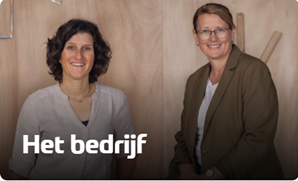

# Woonwerkwoning

## 1. Introductie van het vakgebied

In dit project zullen jullie in de rol van architect treden. Een
architect is iemand die gebouwen en andere structuren ontwerpt. Ze
bedenken hoe gebouwen eruit moeten zien en hoe ze moeten werken.
Architecten combineren creatieve ideeën met technische kennis over
materialen en bouwtechnieken. Ze werken samen met anderen om ervoor te
zorgen dat hun ontwerpen goed worden gebouwd en veilig zijn voor
gebruik. Hun werk beïnvloedt hoe steden eruitzien en hoe mensen hun
omgeving ervaren.

## 2. Opdrachtgever

Opdrachtgevers bij het project zijn Suzanne Schotte en Nina Hoogerbrugge van bouwbedrijf Schotte Hoogerbrugge. Schotte Hoogerbrugge is een bouwbedrijf uit de regio Oostland dat gespecialiseerd is in nieuwbouw, verbouw, renovatie en onderhoud van woningen en bedrijfspanden. Het bedrijf is betrokken bij het hele bouwproces, van planvorming tot oplevering, en streeft naar een optimale samenwerking met de opdrachtgever en de architect.

## 3. Situatie

**Wat is een woonwerkwoning?** Jullie krijgen in dit project de kans om
een woonwerkwoning te ontwerpen, waarbij jullie rekening moeten houden
met zowel de woonbehoeften van bewoners als de functionele eisen van een
werkruimte. Een woonwerkwoning is een type woning dat zowel leefruimte
als werkruimte biedt. Dit type woning is ideaal voor mensen die vanuit
huis werken, zoals freelancers, artiesten of kleine ondernemers. Een
goed ontworpen woonwerkwoning zorgt ervoor dat de werkruimte gescheiden
is van de privéruimte, zodat beide functies optimaal benut kunnen worden
zonder elkaar te verstoren.

**De gegeven locatie** De locatie voor dit
project bevindt midden in Berkel aan de Westersingel. Jullie ontwerp
moet passen binnen deze context en bijdragen aan de visie van een
levendige en duurzame woonomgeving.

## 4. Opdracht

Ontwerp een woonwerkwoning voor een gezin met 2 kinderen, die geschikt
is voor bewoning en werken aan huis. Het ontwerp moet functioneel,
esthetisch aantrekkelijk en passend zijn voor de gegeven locatie. Als
eindresultaat vraagt de opdrachtgever een 3D model waar ze in VR
doorheen kan lopen en een presentatiemaquette op schaal 1:50.

**Doelstellingen**

-   **Creativiteit:** Ontwikkel een uniek en origineel ontwerp dat zowel
    woon- als werkruimte integreert.

-   **Functioneel ontwerp:** Zorg voor een logische indeling van de
    ruimtes die de behoeften van de bewoners en werkers ondersteunt.

-   **Presentatie:** Maak een overtuigende presentatie van je ontwerp,
    inclusief een 3D model en een schaalmodel.

## Ontwerpproces: 

### Stap 1: Oriënteren

In deze fase leggen jullie de basis van wat jullie gaan ontwerpen.
Jullie beginnen met het begrijpen van de eisen van de bewoners en
analyseren de locatie waar de woning moet komen. Dit helpt jullie om een
goede start te maken voor het ontwerp.

**1.1: Collage referentieprojecten (voorbeeldprojecten)**

-   Zoek naar bestaande woonwerkwoningen en andere interessante
    architectuurprojecten die jullie inspireren. Tip: gebruik Pinterest
    en architectuurwebsites zoals ArchDaily.com.

-   Maak een collage van deze projecten. Gebruik afbeeldingen van
    huizen, werkruimtes, interieurs, en interessante architectonische
    details. Geef hierbij aan wat jullie aanspreekt.

**1.2: Locatieanalyse**

-   Maak een tekening van de plek waar
    jullie huis komt te staan, zodat je een goed beeld krijgt van de
    plek. Gebruik hierbij foto's of afbeeldingen als je dat handig
    vindt. Geef hiermee antwoord op de volgende vragen:

    -   Hoe is de bereikbaarheid van de locatie met de auto, fiets en te
        voet? Zijn er veilige routes en parkeerplaatsen?

    -   Zijn er bomen, waterpartijen, of andere natuurlijke elementen op
        of nabij de locatie? Hoe beïnvloeden deze de sfeer of praktische
        aspecten, zoals schaduw.

    -   Hoe is de zoninval op verschillende momenten van de dag?

    -   Wat zijn de kenmerken van de omliggende bebouwing?

    -   Wat is er op de locatie dat je bijzonder leuk of niet leuk
        vindt? Iets dat jullie willen behouden of verwijderen?

    

**1.3: Programma van Eisen en Wensen**

Het programma van Eisen en Wensen (PvE/W) legt vast wat er nodig is (eisen) en wat er gewenst is (wensen), zonder al direct te bepalen hoe het eruit moet zien. De eisen en wensen komen uit de analyse van de locatie, de gebruikers en referentieprojecten. Het bevat een lijst van benodigde ruimtes met oppervlaktes en onderlinge relaties. Daarnaast legt het aandachtspunten vast zoals licht, zicht, privacy, akoestiek, duurzaamheid en toegankelijkheid.

-   Bepaal wat er in het werkgedeelte komt en wat de eisen en wensen
    daarvoor zijn.

-   Werk het programma van eisen en wensen verder uit met aandachtspunten bij elke ruimte. Gebruik hiervoor jullie eigen ideeën over wat belangrijk kan zijn.

    
| Ruimte            | Oppervlakte (m²) | Aandachtspunten bij de Ruimte                                                      |
|-------------------|------------------|-----------------------------------------------------------------------------------|
| Woonkamer         | 30-35            |                       |
| Keuken            | 10-15            |                               |
| Ouderslaapkamer   | 12-15            |             |
| Kinderslaapkamer 1| 10-12            |                                |
| Kinderslaapkamer 2| 10-12            |                                |
| Badkamer          | 8-10             |                   |
| Toilet            | 2-3              |                 |
| Hal/Entree        | 6-8              |                   |
| Werkgedeelte      |  Zelf te bepalen |                                                                     |
| Bergruimte        | 4-6              |            |
| Buitenruimte      | Varieert         |                       |
  

### Stap 2: Schetsontwerp

In deze fase beginnen jullie met het maken van eerste ontwerpen. Jullie
experimenteren met verschillende vormen en indelingen om te zien wat het
beste werkt.

-   Maak vlekkenplannen om te kijken hoe jullie de verschillende ruimtes
    (woonkamer, keuken, slaapkamers, werkgedeelte, etc.) kunnen indelen.

-   Maak verschillende massastudies met
    schuim om verschillende vormen en volumes van het ontwerp te
    verkennen. Gebruik de AI website PromeAI om de massastudies om te
    zetten naar ideeën voor woningen.

###  Stap 3: Voorlopig Ontwerp

In deze fase werken jullie in het team elk een schetsontwerp verder uit.
Jullie beginnen met het maken van plattegronden en gevelaanzichten. De
ontwerpen zullen jullie presenteren aan de opdrachtgever om samen één
ontwerp uit te kiezen voor het definitief ontwerp.

-   Gebruik Floorplanner.com om plattegronden te maken.

-   Maak gevelaanzichten in SketchUp om te zien hoe de buitenkant van je
    huis eruit zal zien.

*Plattegrond en gevelaanzicht*

### Stap 4: Definitief Ontwerp

In deze fase maken jullie het ontwerp helemaal af. Jullie voegen alle
details toe, zoals materialen en interieur, en zorgt dat alles klaar is
voor de presentatie.

-   Werk het SketchUp model verder uit. Voeg details toe zoals ramen,
    deuren en materialen. Voeg ook interieurdetails toe, zoals meubels,
    verlichting en decoratie.

-   Virtuele Rondleiding: Zorg ervoor dat het SketchUp model geschikt is
    voor een VR-rondleiding. Test de VR-ervaring en zorg dat het model
    soepel navigeerbaar is.

-   Maak een maquette op schaal 1:50 van het ontwerp om een tastbaar
    model te laten zien.

*Voorbeelden van maquettes*

### Stap 5: Presentatie

In deze laatste fase presenteren jullie het definitief ontwerp aan
jullie klasgenoten en de opdrachtgever. Dit betekent dat jullie
duidelijk en overtuigend moeten uitleggen wat jullie hebben gemaakt en
waarom jullie bepaalde keuzes hebben gemaakt. De presentatie wordt
ondersteund door een PowerPoint-slides, VR-ervaring en de maquette en
mag maximaal 5 minuten duren.

##  Planning

| Week | Les 1                                                                                     | Les 2                                                                                 | Les 3                                                                                           |
|------|--------------------------------------------------------------------------------------------|----------------------------------------------------------------------------------------|------------------------------------------------------------------------------------------------|
| 36   | x                                                                                          | x                                                                                      | Intro Leerjaar 2 SketchUp workshop                                                          |
| 37   | SketchUp workshop                                                                          | **Di 9 sept x** SketchUp workshop                                                   | **introductie project met OG** Teamvorming en start project Programma van Eisen en Wensen collage van referentieprojecten locatieanalyse |
| 38   | Uitleg schetsontwerp massastudies en vlekkenplannen                                     | massastudies en vlekkenplannen                                                         | massastudies en vlekkenplannen                                                                 |
| 39   | Uitleg voorlopig ontwerp Maken plattegronden en gevelaanzichten                         | Maken plattegronden en gevelaanzichten                                                 | Maken plattegronden en gevelaanzichten **Voorbereiden tussenpresentatie**                   |
| 40   | **Ma 29 sept tussenpresentatie A2aA2b** **Di 30 sept tussenpresentatie G2abH2a** Presenteer voorlopige ontwerpen aan de opdrachtgever | Werk SketchUp model verder uit, Voeg gevels, materialen en interieur toe, Bespreek voortgang en feedback | Werk SketchUp model verder uit, voeg gevels, materialen en interieur toe, Bespreek voortgang en feedback |
| 41   | Afronden van het definitieve ontwerp, Laatste aanpassingen op basis van feedback        | Start met het maken van de schaalmodel (1:50), uitleg technieken en materialen voor maquette, begin met bouwen | Werk verder aan de maquette, zorg voor details en afwerking                                     |
| 42   | **activiteitenweek**                                                                       |                                                                                        |                                                                                                |
| 43   | **herfstvakantie**                                                                         |                                                                                        |                                                                                                |
| 44   | x                                                                                          | Werk verder aan de maquette, zorg voor details en afwerking                            | Werk verder aan de maquette, zorg voor details en afwerking, Bespreek voortgang en feedback    |
| 45   | Werk verder aan de maquette, zorg voor details en afwerking                                | Werk verder aan de maquette, zorg voor details en afwerking                            | Afronden van de maquette, controleer de maquette op volledigheid Verdeel rollen en maak een gestructureerd verhaal, Maak visuele hulpmiddelen (slides, renders, etc.), Bespreek de presentatieplanning |
| 46   | Oefen de presentatie in de groep, verbeter de presentatie op basis van feedback, zorg voor een duidelijke en boeiende presentatie | **Voorstel donderdag 13 november G2abH2a, blok 1** **A2aA2b, blok 3** **Geef de eindpresentatie aan de klas en opdrachtgever** | Reflecteer op het proces en bespreek de feedback                                               |

## Beoordelingsrubric
Het project zal beoordeeld worden met de volgende Rubric.

[📥 Download de rubric (PDF)](../../downloads/rubrics/rubric_woonwerkwoning.pdf)

## Leerdoelen

1.  Ik kan de eisen en wensen van de bewoners bepalen en duidelijk
    formuleren.

2.  Ik kan een collage maken van minimaal 5 inspirerende
    referentieprojecten.

3.  Ik kan een locatieanalyse uitvoeren en de bevindingen presenteren in
    tekeningen.

4.  Ik kan minimaal 3 schetsontwerpen maken voor de woonwerkwoning.

5.  Ik kan een voorlopig ontwerp maken met plattegronden in
    Floorplanner.com en gevelaanzichten in SketchUp en deze presenteren.

6.  Ik kan het definitieve ontwerp in SketchUp uitwerken met gevels,
    materialen, interieurkeuzes en aanpassingen op basis van feedback.

7.  Ik kan een schaalmodel (1:50) van de woonwerkwoning maken met
    aandacht voor details en afwerking binnen zeven weken.

8.  Ik kan een duidelijke en gestructureerde presentatie voorbereiden,
    oefenen en presenteren aan de klas en opdrachtgever.

9.  Ik kan reflecteren op het ontwerpproces, het ontwerp en de
    presentatie, en een reflectie schrijven over mijn ervaringen.
