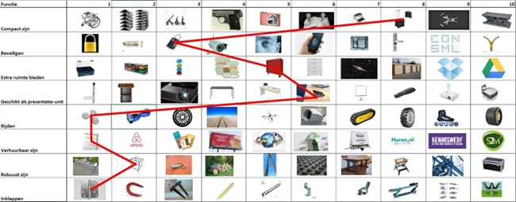

# Sjoelschijfschieter

## Opdrachtgever

**RobertsEngineering** -- een ontwikkelstudio die zich richt op
inclusieve technologische oplossingen voor mensen met een fysieke
beperking.

## Situatie

Sjoelen is een klassiek en sociaal spel dat mensen samenbrengt. Helaas
kunnen sommige mensen met een fysieke beperking dit spel niet
zelfstandig spelen. Een meisje van 8 jaar met een beperking wil
dolgraag weer samen met haar vriendinnen sjoelen. Haar armbeweging is
beperkt, waardoor ze zelf geen schijven over de baan kan schuiven.

RobertsEngineering wil een oplossing ontwikkelen die haar in staat stelt
om toch op een leuke en zelfstandige manier mee te doen aan het spel. De
oplossing moet eenvoudig te bedienen zijn en geschikt zijn voor gebruik
in gezelschap.

## Opdracht

Ontwerp en bouw een werkend prototype van een **sjoelschijfschieter**
die werkt op een powerbank en waarmee een gebruiker met beperkte
armfunctie zelfstandig kan sjoelen.

De schieter moet automatisch sjoelstenen kunnen **laden, richten, en
schieten**, met bediening via één knop of een optionele lichte joystick.

De installatie moet los op verschillende sjoelbakken geplaatst kunnen
worden, zonder permanente bevestiging.

## Programma van Eisen (PvE)

*Voor het ontwerp van een sjoelschijfschieter die een meisje van 8 met
een beperking in staat stelt om zelfstandig te sjoelen met haar
vriendinnen.*

### Algemene eisen

- [ ] De **sjoelschijfschieter werkt op een powerbank** (5V via USB).

- [ ] Het apparaat is **los te plaatsen** op een sjoelbak, en hoeft dus
  **niet permanent bevestigd** te worden.

- [ ] De schieter is **stabiel tijdens gebruik**, ook zonder vastzetten.

- [ ] Indien wél bevestigd, gebeurt dit op **eenvoudige en
  gebruiksvriendelijke manier** (bijv. zuignappen, klemmen of
  magneten).

- [ ] Het apparaat mag maximaal **10 cm uitsteken buiten de sjoelbak** aan
  beide zijkanten.

### Functionaliteit: laden, richten, schieten

- [ ] De gebruiker hoeft **geen schijven handmatig te plaatsen of te
  schuiven** -- het laden gebeurt automatisch of semi-automatisch.

- [ ] De **richting** van de schietrichting kan beïnvloed worden door de
  gebruiker.

- [ ] De **schijf wordt automatisch afgeschoten**, zonder dat de gebruiker
  veel kracht hoeft te zetten.

- [ ] De precieze technische invulling van laden, richten en schieten is
  **vrij voor interpretatie**, zolang het systeem goed werkt en
  eenvoudig te bedienen is.

### Bediening

- [ ] De bediening is geschikt voor een kind van 8 met **beperkte
  armfunctie**.

- [ ] De standaardbediening bestaat uit **één knop**:
  
  - Bij het **indrukken** start de richtbeweging (bijv.
    links/rechts).
  
  - Bij het **loslaten** of **opnieuw indrukken** wordt de richting
    vastgezet en wordt de steen afgeschoten.

- [ ] Bij bediening via knop is een **hoorbare klik of geluid** te horen
  als terugkoppeling.

- [ ] **Alternatieve bediening** is toegestaan, mits goed onderbouwd en
  getest op bruikbaarheid.

## Projectmethode

Bij dit project draait alles om het ontwerpen van een technisch
hulpmiddel dat een echte impact heeft: een sjoelschijfschieter waarmee
een meisje van 8 zelfstandig kan meedoen met een spelletje sjoelen. Dat
vraagt om slimme ideeën, gebruiksvriendelijkheid én goed testen. De
volgende stappen helpen jullie om gestructureerd en creatief te werk te
gaan.

### Wk1 - Stap 1 -- Verken de opdracht en de gebruiker

Verdiep je in de situatie en de wensen van de gebruiker. Lees de
opdracht goed door en bespreek met je team wat de uitdaging is.

- Analyseer de situatie en de PvE.

- Breng de gebruiker in beeld: wat kan ze wel, wat niet?

### Wk1 - Stap 2 -- Ideeëntabel: verken mogelijke oplossingen

Voordat je begint met bouwen of tekenen, denk je na over verschillende
manieren waarop je de belangrijkste functies van de sjoelschijfschieter
kunt uitvoeren. Door ideeën te vergelijken zie je wat de slimste, meest
haalbare of meest gebruiksvriendelijke aanpak is.

Maak een **ideeëntabel** (ook wel morphologisch schema genoemd) waarin
je voor de volgende onderdelen meerdere technische oplossingen bedenkt:
Laden van de sjoelsteen, Richten, Schieten, Bevestiging en plaatsing,

*Figuur 1: Voorbeeld van een spuugmodel*

### Wk2 - Stap 3 -- Maak een keuze uit je ideeën

Na het invullen van de ideeëntabel kies je per functie een oplossing die
past bij jullie doel, gebruiker en middelen. Licht kort toe waarom je
voor deze optie kiest. Je mag ideeën combineren. Soms is de "beste"
oplossing nog niet meteen maakbaar -- kies dan een versie die je snel
kunt testen. Later bijstellen mag altijd als blijkt dat iets toch niet
goed werkt.

### Wk3 - Stap 4 -- Snel eerste ideeën en prototype

Je hebt een richting gekozen---nu snel testen! Maak een simpele
proefopstelling van (een deel van) je idee met karton, LEGO of andere
materialen. Gebruik eventueel een Arduino. Test vroeg, met echte
sjoelstenen, en focus op één functie tegelijk. Schrijf op wat werkt en
wat niet, en pas je ontwerp aan als dat nodig is.

### Wk4 - Stap 5 -- Ontwerp uitwerken in 3D (Fusion 360)

Nu je weet wat werkt (of wat beter moet), ga je het ontwerp verder
uitwerken in een 3D-model in Fusion. Teken de belangrijkste onderdelen,
bepaal de juiste afmetingen en houd rekening met wat je al getest hebt.
Zorg dat je weet hoe onderdelen in elkaar passen en hoe je het gaat
maken (bijv. 3D-printen of lasersnijden).

!!! tip "Aandachtspunten"
    - Denk aan hoe het apparaat in elkaar gezet moet worden (bijv. schroeven, klikverbindingen).
    - Zorg voor ruimte voor elektronica zoals een Arduino, batterij, knop of joystick.
    - Controleer of alles wat je ontwerpt ook **maakbaar** is met de beschikbare materialen en machines.
    - **Houd rekening met de 10 cm-regel:** je ontwerp mag maximaal 10 cm buiten de sjoelbak uitsteken aan beide zijkanten.

### Wk5/6/7 - Stap 6 -- Prototype bouwen, testen en verbeteren

Nu je ontwerp klaar is, bouw je een werkend prototype. Verzamel of maak
de onderdelen, zet alles in elkaar en test of laden, richten, schieten
en bediening goed werken. **Test steeds kleine onderdelen apart én samen
in het geheel.** Test met echte sjoelstenen en pas aan waar nodig.
Noteer wat beter kan en verbeter je ontwerp. Zorg dat het apparaat
stevig, veilig en bruikbaar is. Documenteer je aanpassingen en bereid je
voor op de eindpresentatie.

### Wk8 - Stap 7 -- Voorbereiden eindpresentatie en oplevering

Maak een korte presentatie waarin je het probleem, proces en resultaat
uitlegt. Laat zien wat jullie ontworpen hebben, hoe het werkt en waarom
jullie bepaalde keuzes maakten. Demonstreer het prototype en lever een
duidelijke rapportage in. Vertel ook wat niet werkte en hoe je dat hebt
opgelost, en presenteer het zo dat iedereen het begrijpt.

## Projectplanning

| Week | Les 1                                     | Les 2                                                                |
| ---- | ----------------------------------------- | -------------------------------------------------------------------- |
| 1    | Introductie project + opdracht verkennen  | PvE doornemen + gebruiker en functies analyseren / Ideeëntabel maken |
| 2    | Ideeëntabel maken                         | Keuzes maken uit ideeën + plan van aanpak opstellen                  |
| 3    | Eerste prototype of testopstelling bouwen | Testen en verbeteren (laden, richten of schieten)                    |
| 4    | Verder testen + keuze voor oplossing      | Start 3D-ontwerp in Fusion 360 / 3D-ontwerp in Fusion 360            |
| 5    | Ontwerp afronden in Fusion 360            | Onderdelen printen/snijden en verzamelen                             |
| 6    | Prototype bouwen                          | Prototype testen en aanpassen                                        |
| 7    | Verbeteringen uitvoeren                   | Eindprototype afmaken en testen                                      |
| 8    | Eindprototype afmaken en testen           | Eindpresentatie voorbereiden / Eindpresentatie + oplevering          |

## Beoordelingsrubric

| Beoordelingsaspect                                    | 1 – Onvoldoende                                              | 2 – Matig                                                    | 3 – Voldoende                                              | 4 – Goed                                                          | 5 – Uitstekend                                                                   |
| ----------------------------------------------------- | ------------------------------------------------------------ | ------------------------------------------------------------ | ---------------------------------------------------------- | ----------------------------------------------------------------- | -------------------------------------------------------------------------------- |
| **Begrip van de opdracht**                            | Opdracht is nauwelijks begrepen of verkeerd geïnterpreteerd. | Beperkt begrip van gebruiker en situatie.                    | Opdracht is redelijk begrepen, gebruiker is herkenbaar.    | Goed inzicht in doel en gebruiker, keuzes passen daarbij.         | Uitstekend inzicht, hele ontwerp sluit aan bij behoeften van de gebruiker.       |
| **Ideeontwikkeling**                                  | Nauwelijks ideeën of erg eenzijdig.                          | Enkele ideeën bedacht, maar weinig variatie of onderbouwing. | Meerdere werkbare ideeën, deels onderbouwd.                | Creatieve en haalbare ideeën, goed doordacht.                     | Zeer breed en origineel ideespectrum, met sterke onderbouwing.                   |
| **Prototyping en testen**                             | Geen bruikbaar prototype of geen test gedaan.                | Eenvoudig prototype, nauwelijks getest.                      | Werkend prototype, getest en beperkt aangepast.            | Meerdere testmomenten en duidelijke verbeteringen.                | Zorgvuldige testcyclus, met doordachte verbeteringen op basis van testen.        |
| **3D-ontwerp (Fusion 360)**                           | Geen of slecht passend ontwerp.                              | Onvolledig of weinig bruikbaar ontwerp.                      | Passend ontwerp, functioneel maar basaal.                  | Functioneel, nauwkeurig en goed uitvoerbaar ontwerp.              | Zeer doordacht ontwerp, technisch sterk en maakbaar uitgewerkt.                  |
| **Functioneren van eindproduct**                      | Product werkt niet of nauwelijks.                            | Product voert enkele functies uit, beperkt bruikbaar.        | Product werkt grotendeels, bruikbaar met beperkingen.      | Product werkt goed en voldoet aan PvE.                            | Product werkt uitstekend, gebruiksvriendelijk en goed getest.                    |
| **Samenwerking en planning**                          | Nauwelijks samenwerking, veel onduidelijkheid.               | Enigszins samengewerkt, taakverdeling onduidelijk.           | Samenwerking was voldoende, planning deels gevolgd.        | Goed samengewerkt, duidelijke taakverdeling en planning.          | Uitstekende samenwerking, zelfstandig en gestructureerd gewerkt.                 |
| **Presentatie en verantwoording**                     | Slordige of onvolledige presentatie, zonder uitleg.          | Beperkte uitleg van keuzes, presentatie is onduidelijk.      | Duidelijke presentatie, keuzes worden redelijk onderbouwd. | Verzorgde presentatie met heldere onderbouwing van ontwerpkeuzes. | Sterke presentatie, goed opgebouwd, overtuigend met inzicht in proces en keuzes. |

## Beroep: Mechatronisch ingenieur 

Ben jij iemand die graag dingen ontwerpt, bouwt én laat bewegen? Dan is
**mechatronisch ingenieur** misschien wel jouw droombaan!

Als mechatronisch ingenieur combineer je **mechanica, elektronica en
programmeren** om slimme apparaten te maken. Denk aan robots,
sorteermachines, drones, automatische deuren of medische hulpmiddelen
zoals een elektrische rolstoel of... een sjoelschijfschieter! Jij
bedenkt **hoe iets beweegt**, **hoe het bestuurd wordt**, en **hoe het
allemaal samenwerkt**.

💡 **Wat je doet als mechatronisch ingenieur:**

- Ontwerpen van slimme apparaten of systemen

- Werken met motoren, sensoren, schakelingen en microcontrollers
  (zoals Arduino)

- Dingen bouwen én testen: werkt het echt zoals je bedacht had?

- Samenwerken met andere ontwerpers, programmeurs en technici

🎯 **Waarom dit beroep bij jou kan passen:**

- Je houdt van techniek én creativiteit combineren

- Je wilt iets maken dat écht werkt en mensen helpt

- Je vindt het leuk om te puzzelen met onderdelen, kabels en code

🛠️ **In dit project ben jij eigenlijk al een mini-mechatronisch
ingenieur.** Je denkt na over beweging, maakt een systeem dat iets
automatisch doet én gebruikt elektronica. Wie weet waar dat toe leidt!

---
