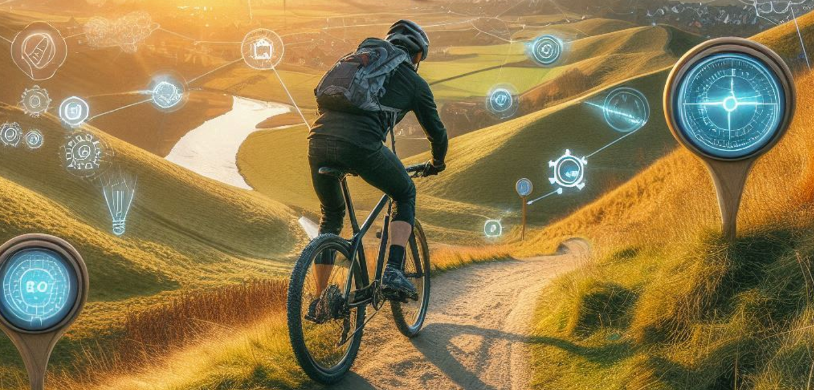
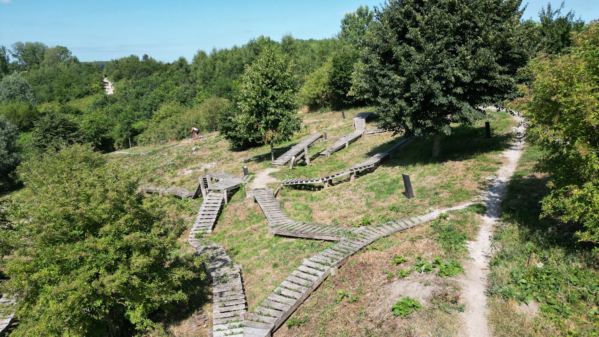
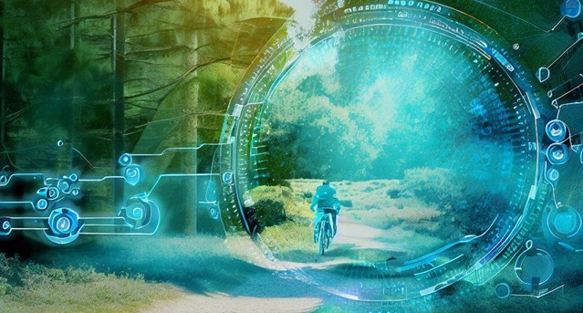

# Dirty Hill -- Snelheid zichtbaar maken

## Opdrachtgever: Mountainbikeclub Dirty Hill

Mountainbikeclub **Dirty Hill** is een actieve en gezellige vereniging
met meer dan 250 leden, waar **recreatief mountainbiken** centraal
staat. De club organiseert uiteenlopende activiteiten zoals wekelijkse
trainingen voor verschillende leeftijden, wedstrijden en clubweekenden.
De sfeer binnen Dirty Hill is informeel en sociaal: leden moedigen
elkaar aan, helpen waar nodig en gunnen elkaar succes. Door de
gevarieerde opzet voelt elk type mountainbiker zich thuis bij Dirty
Hill.

## Probleemstelling

Op het uitdagende parcours bij Outdoor Valley in Bergschenhoek rijden
veel leden wekelijks hun rondjes. Het parcours is smal en biedt weinig
ruimte om in te halen, waardoor directe competitie lastig is. Er is
daarom behoefte aan **meer uitdaging en onderlinge competitie** op basis
van tijden, vooral op specifieke segmenten van het parcours. De club wil
inzicht in wie waar hoe snel rijdt, en leden de mogelijkheid bieden om
zichzelf en elkaar te verbeteren. Hoe kunnen we deze gegevens op een
leuke, toegankelijke en motiverende manier verzamelen, tonen en
gebruiken binnen de clubomgeving?

## Opdracht

Ontwerp een creatief en werkend **prototype** waarmee mountainbikers van
**Dirty Hill** hun snelheid op uitdagende segmenten kunnen meten en
onderling vergelijken.

*Deel van de Mountainbikebaan bij Outdoor Valley*

## Programma van Eisen en Wensen

### Eisen (moet)

De oplossing moet aan de volgende punten voldoen:

-   ✅ Er moet **snelheid of tijd per segment** van het parcours gemeten
    worden.

-   ✅ De metingen moeten aan een **specifieke rijder** gekoppeld kunnen
    worden.

-   ✅ De oplossing moet gegevens kunnen **opslaan** voor later gebruik.

-   ✅ De verzamelde tijden moeten uiteindelijk zichtbaar zijn in de
    **clubapp** of via een systeem dat hieraan gekoppeld kan worden.

-   ✅ Het systeem moet geschikt zijn voor het **gebruik op het
    bestaande parcours bij Outdoor Valley**.

-   ✅ **Visuele feedback** tijdens het rijden moet zichtbaar zijn voor
    de gebruiker

-   ✅ Er moet een **werkend prototype** worden opgeleverd waarmee een
    segmentregistratie gedemonstreerd kan worden.

### Wensen (mag / handig / extra waardevol)

Het zou mooi zijn als de oplossing ook één of meer van de volgende zaken
bevat:

-   ⭐ Er is **visuele feedback** (zoals een lampje of scherm) bij het
    begin of einde van een segment.

-   ⭐ Er kan een **leaderboard** of ranglijst worden weergegeven voor
    segmenten.

-   ⭐ Het systeem herkent **meerdere rijders automatisch**,
    bijvoorbeeld via een tag of chip.

-   ⭐ De installatie is **eenvoudig verplaatsbaar of uitbreidbaar**
    naar andere segmenten of parcoursen.

-   ⭐ De oplossing kan ook gebruikt worden tijdens **clubwedstrijden of
    evenementen**.

-   ⭐ De data kunnen worden geëxporteerd naar bijvoorbeeld een CSV- of
    Excelformaat.

## Werken in taken - ieder zijn rol

In dit project werk je in een team van 6 leerlingen. Om dit goed aan te
pakken, verdelen we het werk in **drie hoofdtaken**. Elke taak is een
belangrijk onderdeel van het systeem dat jullie ontwerpen. Door het
project op te splitsen, kunnen jullie efficiënt samenwerken en
verantwoordelijkheden verdelen. Elk tweetal is **verantwoordelijk** voor
één taak, maar jullie nemen samen beslissingen en helpen elkaar waar
nodig.

### 1. Renners detecteren

**Doel:** Herkennen wanneer een renner langs een bepaald punt rijdt\
**Taken:**

-   Kiezen van een geschikte detectiemethode (RFID, sensorpoort,
    cameradetector, etc.)

-   Bouwen en testen van het detectiesysteem

-   Zorgen voor betrouwbare triggering zonder valspositieven

**Profiel:** technisch onderzoekend / hardwaregericht

### 2. Tijd opnemen en gegevens verwerken

**Doel:** Registreren van tijd en gegevens op een bepaald segment\
**Taken:**

-   Tijd opnemen bij detectie (start/finish)

-   Eventueel verwerken tot rondetijden of sectortijden

-   Data opslaan en/of versturen (bijv. via WiFi/Bluetooth/LoRa)

**Profiel:** programmeergericht / systeemdenker

### 3. Visualisatie tijdens de rit

**Doel:** De prestaties inzichtelijk maken tijdens of direct na de rit\
**Taken:**

-   Real-time weergave op scherm, LED-strip, geluid, etc.

-   Ontwerp van een begrijpelijke en aantrekkelijke gebruikersinterface

-   Koppeling met live data vanuit de meting

**Profiel:** creatief / UX-gericht / vormgever

## Werken met Scrum -- overzicht houden

Tijdens het project werken jullie volgens de **Scrum-methode**. Dit
betekent:

-   Het werk wordt opgeknipt in kleine taken (ook wel 'tickets' of
    'cards').

-   Elke week bekijken jullie als team wat er is gedaan en wat de
    volgende stap is.

-   De voortgang wordt bijgehouden op een digitaal bord, bijvoorbeeld in
    **Trello**.

**Trello-tip:** Maak voor elke hoofdfase een kolom:

-   📥 To Do

-   🔧 Bezig

-   ✅ Klaar

En geef met labels aan bij welke hoofdfunctie de taak hoort:\
🔹 Detectie -- 🟡 Tijden -- 🔵 Visualisatie

Zo hou je goed overzicht en kun je als team flexibel inspelen op wat wel
of nog niet werkt.

*2 Trello bord via www.trello.com*

## Projectmethode

Om tot een slimme en werkende oplossing te komen, volg je samen met je
team een ontwerpproces. Dit proces helpt je om stap voor stap van
probleem naar prototype te komen. Je hoeft nog niet alles te weten over
technologie, programmeren of meten -- je leert tijdens het project wat
nodig is. In elke stap onderzoek je wat werkt en maak je keuzes die
passen bij jullie oplossing.

### 1. Oriënteren op de opdracht -- week 1

Je start met een verkenning van de opdrachtgever: wie is Dirty Hill? Wat
voor soort club is het, en wat is precies de uitdaging waar ze mee
zitten? Je onderzoekt hoe het parcours eruitziet, wat segmenten zijn, en
waarom er behoefte is aan onderlinge competitie.

👉 *Doel: goed begrijpen voor wie en waarom je dit maakt.*

### 2. Behoeften en eisen in kaart brengen -- week 1

Je verdiept je in het **programma van eisen en wensen**. Wat moet jullie
oplossing minimaal kunnen, en wat zou mooi zijn om extra toe te voegen?
Denk ook na over de gebruikers: zijn dat jonge rijders,
wedstrijdfanaten, trainers?

👉 *Doel: weten waar je oplossing aan moet voldoen, technisch én
gebruiksvriendelijk.*

### 3. Inspiratie en technische mogelijkheden onderzoeken -- week 1

Je kijkt naar bestaande systemen en technieken die zouden kunnen werken.
Denk hierbij aan vragen als:

-   Hoe meet je of iemand langs een punt fietst?\
    Bijv. met een **sensor die beweging detecteert** of met **Bluetooth
    of GPS**.

-   Hoe weet het systeem **wie er langsrijdt**?\
    Bijv. met een **RFID-kaart**, een **telefoon met Bluetooth**, of
    helemaal anoniem.

-   Hoe kun je de **tijd of snelheid registreren en opslaan**?\
    Denk aan een **microcontroller zoals de Raspberry Pi Pico W** of een
    **ESP32**, in combinatie met een **display, wifi of SD-kaart**.

-   Hoe laat je de resultaten zien?\
    Bijv. op een **website, in een app, op een schermpje of via een
    lijst op de clubpagina**.

Je hoeft nu nog geen keuzes te maken, maar wel te snappen wat mogelijk
is.

👉 *Doel: technische inspiratie opdoen voor je eigen oplossing.*

### 4. Ideeën bedenken -- week 2

Nu ga je **breed brainstormen**. Hoe zou je dit kunnen oplossen? Hoe
ziet het eruit, hoe werkt het? Denk aan verschillende opstellingen: een
meetpaal bij een segment, een kastje op de fiets, een RFID-punt bij de
start, enzovoort.

👉 *Doel: veel ideeën genereren voordat je er één kiest.*

### 5. Concept kiezen en uitwerken -- week 3

Je kiest samen het meest kansrijke of interessante idee uit en werkt dit
verder uit in een concept. Je maakt schetsen of een storyboard, denkt na
over de onderdelen die je nodig hebt, en bedenkt hoe je gaat testen.

👉 *Doel: een helder plan voor wat je gaat maken en wat je wilt bewijzen
of demonstreren.*

### 6. Prototype bouwen -- week 4/5

Je gaat bouwen aan een eerste werkend prototype. Dit kan eenvoudig
beginnen: een sensor die een fiets detecteert, een timer die start en
stopt, of een systeem dat iets opslaat of laat zien. Je test onderdelen
afzonderlijk en koppelt ze daarna samen. Je mag gebruikmaken van onder
andere:

-   **Sensoren** (zoals een ultrasone afstandssensor om voorbijgangers
    te detecteren)

-   **Microcontrollers** (zoals de Raspberry Pi Pico W, waarmee je kunt
    programmeren en data versturen via wifi)

-   **Display** (zoals een OLED-scherm om tijd of namen te tonen)

-   **Beacons of tags** (zoals BLE of RFID om personen te herkennen)

-   **Datalogging** (bijv. met wifi naar een database, of lokaal
    opslaan)

👉 *Doel: een eerste versie maken van een systeem dat écht werkt -- al
is het nog simpel of op kleine schaal.*

### 7. Testen en verbeteren -- week 5/6/7

Je test je prototype in een realistische situatie. Werkt het als er
iemand langsfietst? Herkent het systeem de rijder? Wordt de tijd goed
gemeten? Wat vinden gebruikers ervan? Op basis van je tests verbeter je
je ontwerp.

👉 *Doel: zorgen dat je prototype betrouwbaar is en goed laat zien wat
jouw oplossing toevoegt.*

### 8. Presenteren -- week 8

Je presenteert je oplossing aan je klas, je docent(en) en -- als het kan
-- aan de opdrachtgever van Dirty Hill. Je laat zien hoe jullie proces
is verlopen, wat je hebt geleerd, en natuurlijk wat je prototype kan.
Dat mag met een live demo, een filmpje, een poster of een combinatie
daarvan.

👉 *Doel: duidelijk en overtuigend laten zien hoe jouw idee werkt én
waarom het waardevol is.*

## Projectplanning

**Duur:** 8 weken -- 2 lessen per week + 3de les zelf ingezet (± 24
lessen)

**Einddoel:** Werkend prototype + presentatie + verslag

| Week | Les 1                                                                 | Les 2                                         |
|------|------------------------------------------------------------------------|-----------------------------------------------|
| 37   | Introductie project & opdrachtgever Verkenning parcours & PvE + gebruikers | Onderzoek technieken (detectie, opslag)       |
| 38   | Inspiratievoorbeelden + eerste ideeën                                   | Brainstormen & ideeën presenteren             |
| 39   | **Tussenpresentatie** Conceptkeuze + globale uitwerking             | Technisch plan + onderdelen bepalen           |
| 40   | Start met bouwen: testen losse onderdelen                              | Verder bouwen aan prototype                   |
| 41   | Detectie / tijdregistratie werkend maken                               | Prototyping deel 2 + feedback verzamelen      |
| 42   | **Maandag 5 klassen naar ProDemos Den Haag** Verbeteren op basis van testresultaten | Verbeteren op basis van testresultaten        |
| 43   | **Herfstvakantie**                                                     |                                               |
| 44   | **Maandag 2-daagse**                                                   | Test in situatie (indoor of buiten) Afronden prototype + documentatie |
| 45   | Voorbereiden eindpresentatie                                           | **Woensdag Start toetsweek**                  |
| 46   | **toetsweek**                                                          |                                               |
| 47   | **Ma 17 nov Eindpresentatie**                                          | **Terugblik, evaluatie en feedback**          |

## Beoordeling
Het project zal beoordeeld worden met de volgende Rubric.

[📥 Download de rubric (PDF)](../../downloads/rubrics/rubric_dirtyhill.pdf)

##  Studie & Beroep

In dit project werk je aan een echte uitdaging van mountainbikeclub
**Dirty Hill**, waarbij techniek, sport en data samenkomen. Je
onderzoekt hoe je beweging kunt meten, data kunt opslaan en prestaties
inzichtelijk kunt maken --- allemaal met slimme technologie. Daarmee
stap je in de wereld van:

-   **Embedded systems**: je leert werken met microcontrollers (zoals de
    Raspberry Pi Pico) en sensoren die samen een slim systeem vormen.

-   **Internet of Things (IoT)**: het meten en versturen van gegevens
    over het parcours lijkt sterk op wat ook gebeurt in slimme
    apparaten, gebouwen of voertuigen.

-   **Technisch ontwerpen**: je bedenkt niet alleen *wat* je gaat maken,
    maar vooral *hoe* het werkt en gebruikt wordt.

-   **Data en software**: of je nu met timers, Bluetooth, WiFi of
    visualisatie werkt --- je combineert hardware en software op een
    functionele manier.

💡 Denk aan vervolgstudies als:

-   **HBO/WO Elektrotechniek**, **Embedded Systems**, **Mechatronica**
    of **Informatica**

-   **Technische Natuurkunde**, **Werktuigbouwkunde**, of een richting
    in **Smart Technology**

-   Of opleidingen in **Sporttechnologie**, **Technische Innovatie**, of
    **Data Science**

👷‍♀️ Je werkt zoals echte engineers, productontwikkelaars of
data-analisten die slimme oplossingen ontwerpen voor sport, mobiliteit
of recreatie. Denk aan systemen zoals Strava, interactieve sportparken,
smartwatches of fietscomputers.

