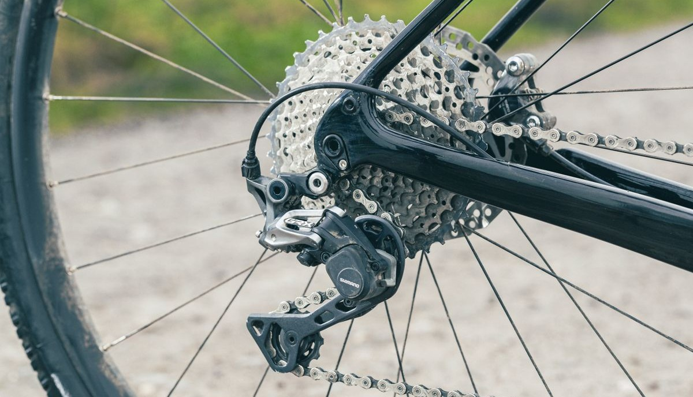
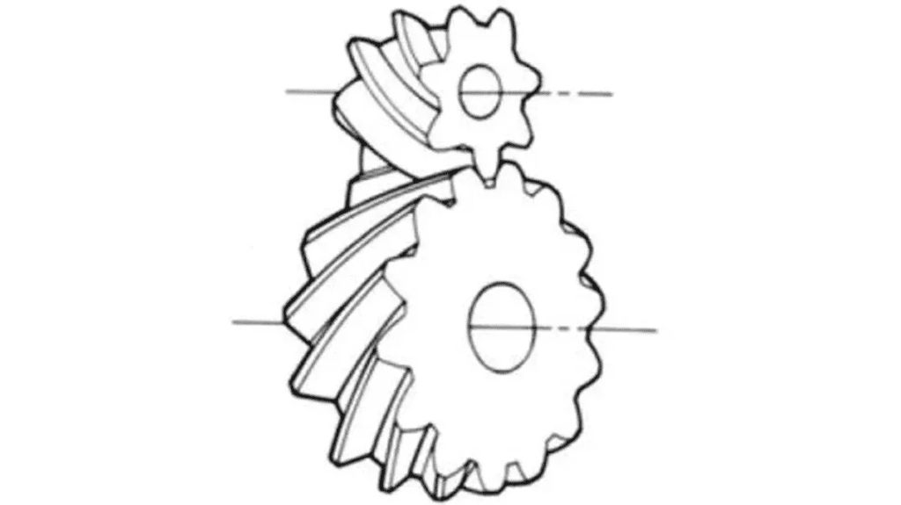
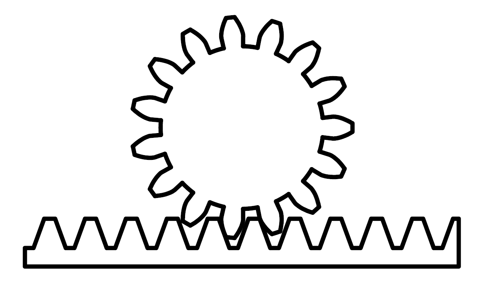
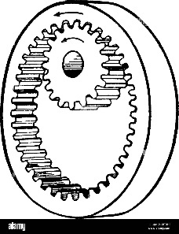
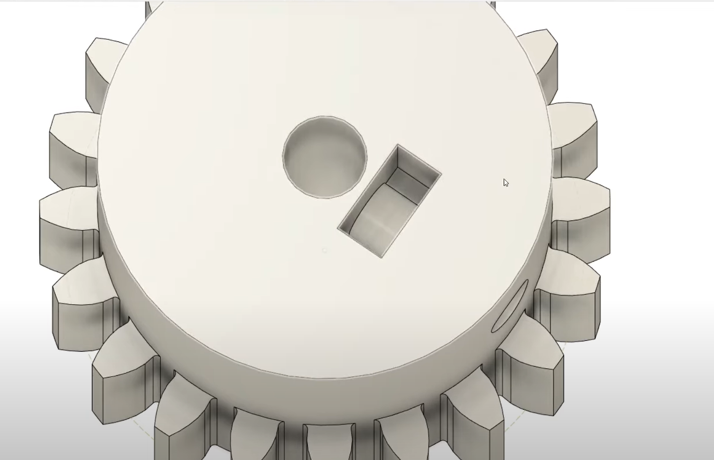
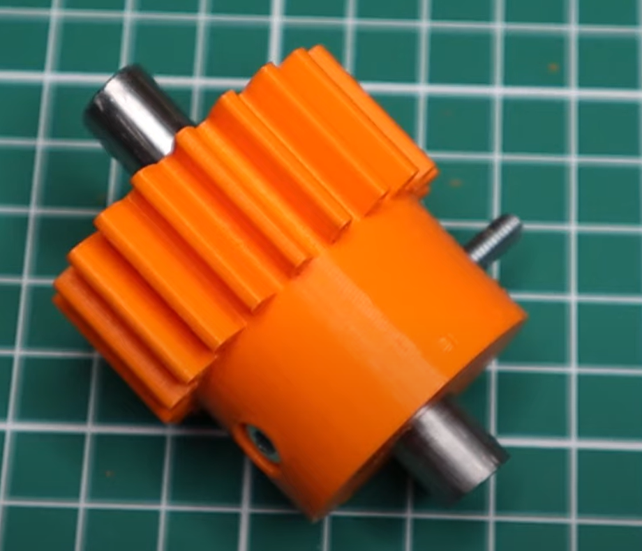
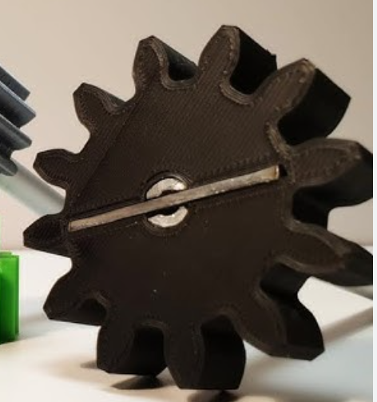
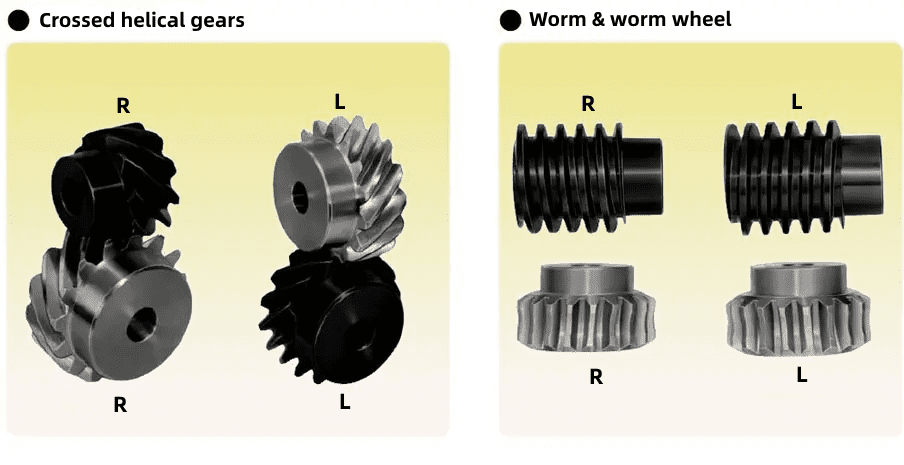

# Alles over Tandwielen

## 1. Wat zijn tandwielen?

*Tandwielen zie je overal: in fietsen, horloges, robots en motoren. Maar
wat doen ze eigenlijk?*\
Tandwielen zijn ronde schijven met tanden die beweging overbrengen van
de ene as naar de andere. Door hun vorm kunnen ze kracht, snelheid en
draairichting veranderen op een precieze manier.

## 2. Waarom tandwielen gebruiken?

*Tandwielen zijn handig als je iets langzamer, sneller, sterker of in
een andere richting wilt laten draaien.* 
Ze maken het mogelijk om met een kleine motor toch iets zwaars te laten bewegen, of juist een snelle
beweging te maken met weinig kracht.

-   **Vertragen of versnellen** → Door verschil in tandwielgrootte

-   **Kracht vergroten** → Groter wiel draait langzamer, maar met meer
    kracht

-   **Beweging omleiden** → Bijvoorbeeld van horizontaal naar verticaal

-   **Richting veranderen** → Linksom wordt rechtsom, of haaks draaien

*Figuur 2. Tandwielen bij een fiets.*

## 3. Soorten tandwielen

*Er zijn verschillende soorten tandwielen, elk geschikt voor een ander
soort beweging of toepassing.*
Hieronder zie je de meest voorkomende types tandwielen en waar ze voor
gebruikt worden:

  ------------------------------------------------------------------------------------------------------------------------------------------------

| Type                   | Engelse term   | Diagram                                                      | Beschrijving                                                                 |
|------------------------|----------------|--------------------------------------------------------------|-------------------------------------------------------------------------------|
| Recht tandwiel         | Spur gear      |  | Tanden staan recht op de as; voor eenvoudige overbrengingen.                  |
| Schuin tandwiel        | Helical gear   |  | Tanden staan schuin; stiller en soepeler, maar moeilijker te maken.           |
| Dubbel schuin tandwiel | Herringbone    |  | Twee tegengestelde schuine tandwielen tegen elkaar; kracht + axiale stabiliteit. |
| Kegelwiel              | Bevel gear     |  | Kegels die haaks op elkaar staan; voor hoeken (bijv. 90°).                    |
| Wormwiel               | Worm gear      |  | Schroef die in een wiel grijpt; grote vertraging.                             |
| Rondsel & tandlat      | Rack & pinion  |  | Wiel met tanden op rechte rail; maakt draaiende beweging lineair.             |
| Inwendig vertand       | Internal gear  | | Tanden aan de binnenkant; vaak met planeetwielen.                              |
| Planetaire overbrenging| Planetary gear |  | Meerdere tandwielen rondom een centrale as; compact en krachtig.              |

## 4. Hoe werkt een overbrengingsverhouding?

*Met tandwielen kun je de verhouding tussen snelheid en kracht
bepalen.*\
Dat doe je met een **overbrengingsverhouding**: een groot tandwiel
draait langzamer maar krachtiger, een klein tandwiel draait sneller. De
verhouding bereken je als volgt:

**Overbrengingsverhouding = tanden aangedreven tandwiel / tanden
aandrijvend tandwiel**

*Bijv. tandwiel 1 heeft 10 tanden, tandwiel 2 heeft 30 tanden:\
**Overbrenging = 30 / 10 = 3:1**\
→ Het grote tandwiel draait 3x zo langzaam, maar met meer kracht.*

## 5. Waar moet je op letten bij het ontwerpen?

*Een goed werkend tandwiel begint bij een goed ontwerp.* Zorg dat de
tandwielen bij elkaar passen, niet te veel speling hebben en stevig
genoeg zijn voor de krachten die erop komen. Denk ook aan de afstand
tussen de assen en het juiste aantal tanden.

-   **Moduul** (maat van de tanden): beide tandwielen moeten dezelfde
    moduul hebben

-   **Aantal tanden**: hoe meer tanden, hoe vloeiender

-   **As-afstand**: moet passen bij gekozen tandwielen

-   **Terugslag (backlash)**: speling tussen tanden

-   **Sterkte en slijtage**: gebruik eventueel een vet of tandwielen van
    nylon/kunststof

## 6. Tandwielen maken in Fusion 360

*Je hoeft tandwielen niet zelf te tekenen -- Fusion 360 heeft daar
handige hulpmiddelen voor.*\
Gebruik de Add-in **Spur Gear, GF Gear Generator** of **Helical gear +**
om snel een werkend tandwiel te maken met de juiste instellingen. Je
kunt ook een gat toevoegen voor een motoras of een schroef.\

  <iframe src="https://www.youtube.com/embed/MtK6yK0NRM0" 
          style="position: absolute; top:0; left: 0; width: 100%; height: 100%;" 
          frameborder="0" 
          allow="accelerometer; autoplay; clipboard-write; encrypted-media; gyroscope; picture-in-picture" 
          allowfullscreen>
  </iframe>

## 7. Bevestigen aan as of motor

*Tandwielen moeten stevig vastzitten om goed te kunnen draaien.* Kies de methode die past bij je ontwerp en de krachten die erop komen.

| Methode        | Uitleg                                                                 | Voorbeeld |
|----------------|------------------------------------------------------------------------|-----------|
| Perspassing    | Tandwiel met krap gat dat stevig over de as wordt gedrukt.             | |
| Klemschroef    | Klein schroefje (grub screw) dat in de as klemt.                       |    |
| Schroef door gat en as   | Dwars door tandwiel én as een boutje/schroef; voorkomt slippen.        |   |
| Sleuf of spie  | Gat met uitsparing + bijpassend profiel op de as.                      |     | 
| Adapter/hub    | Tandwiel op metalen hub; met bouten aan as bevestigd.                  |  |
| Lijmen         | Alleen voor lichte belastingen.                                        | |

Bekijk ook:

**BEST Ways to Connect Your 3D Printed Gears to the Rotating Shaft\
**<https://www.youtube.com/watch?v=Lnk9Cn2WlqA&ab_channel=Let%27sPrint>

**How to Design and 3D print basic spur gears, and how to attach them to
shafts (Gears part 1/7)\
**<https://www.youtube.com/watch?v=xEFaYdnqIBQ&t=2093s&ab_channel=Antalz>

## Tandwieltermen

Tandwielen hebben veel specifieke termen en begrippen die uniek zijn
voor hun ontwerp en werking. Om het begrip van tandwielen te verbeteren,
volgt hieronder een overzicht van veelgebruikte basisbegrippen.

### 1) Benamingen van tandwielonderdelen

Tandwielen bestaan uit verschillende onderdelen, zoals de naaf,
steekcirkel, tandtop (addendum), tandvoet (dedendum) en tandflanken. Elk
onderdeel speelt een rol in de werking van het tandwiel en de manier
waarop het samenwerkt met andere tandwielen.

### 2) De term voor tandgrootte: de Moduul

De **moduul (m)** is een internationale standaardmaat die de grootte van
de tand bepaalt, aangeduid met bijvoorbeeld m1, m3, m8. Hoe groter het
getal, hoe groter de tanden. De moduul is de afstand in millimeters over
de steekcirkel per tand.

In landen waar men imperiale eenheden gebruikt (zoals de VS), gebruikt
men de **Diametral Pitch (DP)**. Dit geeft aan hoeveel tanden een
tandwiel zou hebben met een steekcirkel van 1 inch, zoals DP24 of DP8.
Er is ook een methode met **Circular Pitch (CP)** in millimeters, zoals
CP5 of CP10.

De **steek (p)** is de afstand tussen twee opeenvolgende tanden, en
wordt berekend met:

**p = π × m**

Vergelijking van tandgroottes bij verschillende modules toont duidelijk
het effect van de moduul op het uiterlijk van het tandwiel.\

### 3) Drukhoek (Pressure Angle)

De **drukhoek (α)** bepaalt de vorm van de tandflank. Dit is de hoek
tussen de straallijn op het steekpunt en de raaklijn aan het
tandprofiel. Standaard is deze hoek meestal 20°, maar vroeger was 14,5°
gebruikelijk.

Een grotere drukhoek geeft sterkere tanden en meer draagvermogen, maar
verhoogt ook de glijwrijving tussen de tanden, wat de efficiëntie kan
beïnvloeden.

Wanneer tandwiel A in grijpt op tandwiel B, oefent A een kracht uit op B
langs de gemeenschappelijke normaal. Deze normaal ligt in de richting
van de druk, en vormt de hoek α.

De drie belangrijkste parameters voor een tandwiel zijn:

-   **Moduul (m)**

-   **Drukhoek (α)**

-   **Aantal tanden (z)**

Deze vormen de basis voor het berekenen van de afmetingen van
tandwielonderdelen.

### 4) Tanddiepte en tanddikte

De **tanddiepte** wordt bepaald door de moduul en is de som van de
addendumhoogte en dedendumhoogte:

**Totale tandhoogte h = 2,25 × m**\
waarbij:

-   **Addendumhoogte (ha) = 1 × m**

-   **Dedendumhoogte (hf) = 1,25 × m**

De **tanddikte (s)** op de steekcirkel is de helft van de steekafstand
(en.: pitch):

**s = ½ × π × m**

Deze maten zorgen ervoor dat tandwielen goed in elkaar grijpen en soepel
werken.\

### 5) Tandwieldiameters

De **steekcirkeldiameter (d)** is de basis voor het bepalen van
tandgrootte en wordt als volgt berekend:

**d = z × m**

Andere relevante diameters:

-   **Topcirkeldiameter (da) = d + 2m**

-   **Voetcirkeldiameter (df) = d − 2,5m**

De steekcirkel is een denkbeeldige cirkel, maar essentieel voor ontwerp
en berekening van tandwielen.

### 6) Harteafstand en tandspeling

Wanneer twee tandwielen in elkaar grijpen via hun steekcirkels, wordt de
**harteafstand (a)** bepaald door:

**a = (d₁ + d₂) / 2**

Voor een soepele overbrenging is er ook **speling** nodig. Dit is de
ruimte tussen de onderkant van een tand en de bovenkant van de
tegenoverliggende tand.

De verticale speling (in richting van tandhoogte) is:

**c = 1,25m − 1m = 0,25m**

Deze speling voorkomt vastlopen en zorgt voor een goede werking.

### 7) Schuine tandwielen (Helical Gears)

Schuine tandwielen zijn rechte tandwielen
waarvan de tanden in een spiraalvorm staan. Ze lopen stiller en kunnen
meer kracht overbrengen dan rechte tandwielen.

Er zijn twee manieren om de moduul en drukhoek te benaderen:

-   **Axiale referentie (mt)**: gebaseerd op het uiteinde van het
    tandwiel

-   **Normale referentie (mn)**: gebaseerd op een vlak loodrecht op de
    tand

De relatie tussen deze twee is:

**mt = mn / cos(β)**\
waarbij β de spiraalhoek is.

**8) Spiraalrichting en tandwielcombinaties**

Schuine tanden kunnen **rechtsdraaiend**
of **linksdraaiend** zijn, afhankelijk van de richting waarin ze schuin
staan.

Combinaties van tandwielen:

-   **Rechts + rechts** → werkt goed ✔️

-   **Links + links** → werkt ook goed ✔️

-   **Rechts + links** → werkt niet goed ❌

De juiste combinatie is belangrijk voor een goede krachtoverbrenging.

## Samenvatting

- Tandwielen zorgen voor krachtoverdracht en aanpassing van snelheid/koppel.
- Er bestaan verschillende soorten: rechte, schuine, kegeltandwielen, wormwielen, etc.
- Het aantal tanden en de verhouding bepalen de overbrenging.
- Kies het juiste tandwieltype afhankelijk van toepassing (stilte, kracht, richting).