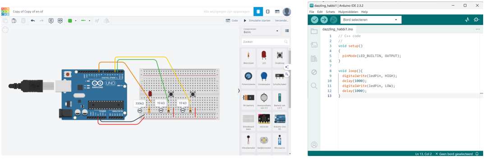

# Arduino - Introductie en Opdrachten

Arduino is een open-source platform voor het maken van interactieve elektronische projecten. Het bestaat uit zowel hardware als softwarecomponenten en is ontworpen om het bouwen en programmeren van elektronische circuits eenvoudig te maken, ook voor beginners.

## Kenmerken van Arduino

- **Microcontroller Board**: Zoals de Arduino Uno. Dit board bevat een microcontroller die input leest van sensoren en output stuurt naar actuatoren.
- **Eenvoudige programmeertaal**: Gebaseerd op C/C++, makkelijk te leren.
- **Veelzijdigheid**: Van knipperende LED’s tot domotica en robotica.
- **Grote community**: Veel tutorials, voorbeelden en hulp online.

Met Arduino kun je creatieve en interactieve projecten bouwen voor school, hobby of werk.

---
## Tinkercad Circuits en Arduino IDE

### Tinkercad Circuits

*Tinkercad Circuits links en de Arduino IDE rechts*

Tinkercad Circuits is een online simulator voor elektronische schakelingen. Met Tinkercad Circuits kan je elektronische projecten maken en experimenteren zonder dat je fysieke componenten nodig hebt.

1. Ga naar [https://www.tinkercad.com/circuits](https://www.tinkercad.com/circuits)
2. Voeg de klascode van je docent toe
3. Log in met je Autodesk-account (hetzelfde als voor Fusion 360)

### Arduino IDE

De Arduino IDE is nodig om code naar een fysiek Arduino-board te sturen.

1. Ga naar [https://www.arduino.cc/en/software](https://www.arduino.cc/en/software)
2. Download de IDE voor jouw besturingssysteem (Windows/macOS/Linux)
3. Installeer de software

---

## Van Tinkercad naar Arduino

Je gaat in de opdrachten in Tinkercad een code maken. Om het op de fysieke Arduino te krijgen, moet de code overgezet worden naar de Arduino IDE. Dit gaat als volgt:

1. Open je project in Tinkercad
2. Klik op `Code` > `Download` > `.ino` bestand

3. Open dit bestand in de Arduino IDE
4. Sluit je Arduino aan via USB
5. Selecteer het juiste board en COM-poort onder **Hulpmiddelen**

6. Klik op **Verifiëren**  om je code te testen
7. Klik op **Uploaden**  om de code op je Arduino te zetten

> 💡 **Tip:** Geef elk project dezelfde naam als de opdracht.

## Foutopsporing

Programmeren en werken met elektronica gaat zelden in één keer goed. Het is heel normaal dat je fouten tegenkomt of dat je schakeling niet direct werkt zoals je verwacht. Dat hoort bij het leerproces! Door rustig te kijken waar het misgaat en stap voor stap te testen, leer je niet alleen het probleem op te lossen, maar begrijp je ook beter hoe de Arduino en je code werken.

!!! warning "Foutopsporing"
    Lees de stappen die je kan nemen om fouten op te sporen  [stappen](21_problemen_opsporen.md)
