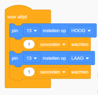

## 🔧 Opdracht 1: Blink

In deze opdracht leer je hoe je een LED kunt laten knipperen met behulp van een Arduino. Je verbindt de LED met een digitale pin van de Arduino en schrijft vervolgens een code dat de LED met tussenpozen aan en uit zet, zodat het lijkt alsof deze knippert.

### 🧪 Tinkercad-opdracht

1.1 Bouw de schakeling na zoals getoond in de afbeelding.  
1.2 Programmeer de Arduino met de code van de afbeelding om de LED te laten knipperen.

---

### 🔁 Verwerkingsopdracht

1.3 Pas de code aan zodat de LED **twee keer zo snel** knippert als in de oorspronkelijke code.  
1.4 Laat de LED **één keer snel knipperen** gevolgd door een **langzame knipper**: voeg hiervoor een paar stappen toe aan de code.

---

### 🔌 Fysieke opdracht

1.5 Bouw dezelfde schakeling met een fysieke Arduino, een breadboard, een LED en jumperdraden.  
Programmeer de Arduino met dezelfde code die je hebt gebruikt in Tinkercad en zie hoe de LED knippert.
