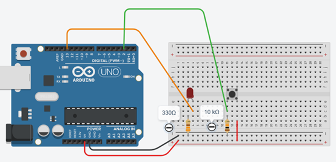

# Opdracht 4: LED met drukknop

In dit project leer je hoe je de Arduino kunt vertellen om iets te doen als een bepaalde situatie zich voordoet, en iets anders te doen als dat niet het geval is.  
Je gebruikt de **if (als)** en **else (anders)** statements om te beslissen welke acties de Arduino moet uitvoeren op basis van bepaalde voorwaarden.

!!! tip "Uitleg if-statement"
    Nog niet bekend met een if-statement?  Lees eerst de [uitleg over if-statment](08_if-statement.md).

---

## Tinkercad Opdracht

**4.1** Bouw de schakeling na zoals getoond in de afbeelding.  
**4.2** Programmeer de Arduino met de onderstaande code.  




---

## Code

```cpp
int buttonPin = 2; // Pin voor de drukknop
int ledPin = 13;   // Pin voor de LED

void setup() {
  pinMode(buttonPin, INPUT); // Configureer de drukknop pin als invoer
  pinMode(ledPin, OUTPUT);   // Configureer de LED pin als uitvoer
}

void loop() {
  if (digitalRead(buttonPin) == HIGH) { // Controleer of de drukknop is ingedrukt
    digitalWrite(ledPin, HIGH);         // Schakel de LED in
  } else {
    digitalWrite(ledPin, LOW);          // Schakel de LED uit
  }
}
```

---

## Verwerkingsopdracht

**4.3** Pas de code aan zodat de LED **snel knippert** wanneer de drukknop wordt ingedrukt en **continu brandt** wanneer de drukknop niet wordt ingedrukt.  

---

## Fysieke Opdracht

**4.4** Bouw dezelfde schakeling met een fysieke Arduino, een breadboard, een drukknop en een LED.  
Programmeer de Arduino met dezelfde code die je hebt gebruikt in Tinkercad en observeer hoe de LED reageert op het indrukken van de drukknop.  
