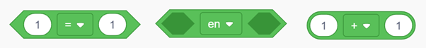

# Operatoren

Operatoren in programmeren zijn speciale tekens die de computer vertellen wat te doen met getallen, letters of andere gegevens.  
Ze helpen je om dingen te vergelijken, samen te voegen of te veranderen.  
Denk aan operatoren als gereedschappen in een gereedschapskist die je helpen om taken uit te voeren en problemen op te lossen.

---

## 1. Vergelijkingsoperatoren

- `==` (gelijk aan): controleert of twee waarden gelijk zijn.  
- `!=` (niet gelijk aan): controleert of twee waarden niet gelijk zijn.  
- `>` (groter dan): controleert of de ene waarde groter is dan de andere.  
- `<` (kleiner dan): controleert of de ene waarde kleiner is dan de andere.  
- `>=` (groter dan of gelijk aan): controleert of de ene waarde groter is dan of gelijk is aan de andere.  
- `<=` (kleiner dan of gelijk aan): controleert of de ene waarde kleiner is dan of gelijk is aan de andere.  

**Voorbeelden:**
```cpp
if (a == b) { /* doe iets */ }
if (a != b) { /* doe iets */ }
if (a > b)  { /* doe iets */ }
if (a < b)  { /* doe iets */ }
if (a >= b) { /* doe iets */ }
if (a <= b) { /* doe iets */ }
```

---

## 2. Logische operatoren

- `&&` (en): combineert twee voorwaarden waarvan **beide waar** moeten zijn.  
- `||` (of): combineert twee voorwaarden waarvan **minstens één waar** moet zijn.  
- `!` (niet): keert de waarde van een voorwaarde om.  

**Voorbeelden:**
```cpp
if (a > 5 && a < 10) { /* doe iets */ }
if (a == 3 || a == 7) { /* doe iets */ }
if (!(a == b))        { /* doe iets */ }
```

---

## 3. Toekenningsoperatoren

- `=` (toekennen): ken een waarde toe aan een variabele.  
- `+=`, `-=`, `*=`, `/=`: voer een berekening uit met de huidige waarde van de variabele en wijs het resultaat opnieuw toe.  

**Voorbeeld:**
```cpp
int a = 5;
a += 2; // hetzelfde als a = a + 2;
```

---

## 4. Increment en decrement operatoren

- `++` (increment): verhoog de waarde van een variabele met 1.  
- `--` (decrement): verlaag de waarde van een variabele met 1.  

**Voorbeelden:**
```cpp
a++; // hetzelfde als a = a + 1;
a--; // hetzelfde als a = a - 1;
```

---

## Tinkercad

In **Tinkercad** kun je de bijbehorende blokken vinden onder *Rekenen*.  


