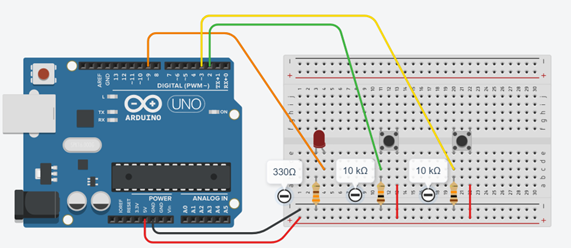
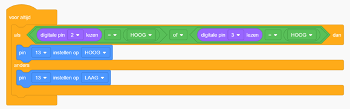

# Opdracht 5: EN/OF functie

In deze opdracht leer je hoe je de Arduino kunt vertellen wat te doen in verschillende situaties, zelfs als die situaties wat ingewikkelder zijn.  
Je gebruikt de **EN (&&)** en **OF (||)** operatoren om meerdere voorwaarden te combineren en zo te bepalen welke acties de Arduino moet uitvoeren.  

---

## Tinkercad Opdracht

**5.1** Bouw de schakeling na zoals getoond in de afbeelding.  
**5.2** Programmeer de Arduino met de onderstaande code.  






---

## Code

```cpp
int buttonPin1 = 2; // Pin voor de eerste drukknop
int buttonPin2 = 3; // Pin voor de tweede drukknop
int ledPin = 13;    // Pin voor de LED

void setup() {
  pinMode(buttonPin1, INPUT); // Configureer de eerste drukknop pin als invoer
  pinMode(buttonPin2, INPUT); // Configureer de tweede drukknop pin als invoer
  pinMode(ledPin, OUTPUT);    // Configureer de LED pin als uitvoer
}

void loop() {
  if (digitalRead(buttonPin1) == HIGH || digitalRead(buttonPin2) == HIGH) {
    digitalWrite(ledPin, HIGH); // Schakel de LED in als één van de knoppen wordt ingedrukt
  } else {
    digitalWrite(ledPin, LOW);  // Schakel de LED uit in alle andere gevallen
  }
}
```

---

## Fysieke Opdracht

**5.3** Bouw dezelfde schakeling met een fysieke Arduino, een breadboard, twee drukknoppen en een LED.  
Programmeer de Arduino met dezelfde code die je hebt gebruikt in Tinkercad en observeer hoe de LED reageert op het indrukken van de drukknoppen.  

---

## Verwerkingsopdracht

**5.4** Verander de code zo dat de LED **alleen aan gaat als knop 1 én knop 2 tegelijkertijd worden ingedrukt**.  
