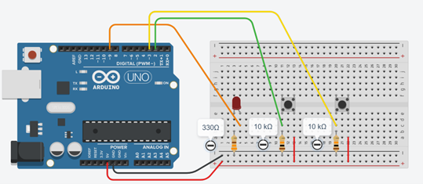
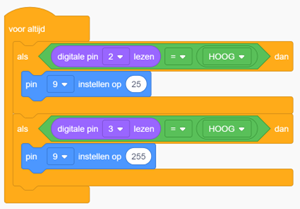

# Opdracht 6: LED Felheid

In deze opdracht leer je hoe je de helderheid van een LED kunt regelen met behulp van twee drukknoppen.  
De ene knop laat de LED fel branden en de andere knop minder fel.  

Je gebruikt een digitale ingang om te detecteren wanneer de knoppen worden ingedrukt en een **PWM-signaal** om de LED-helderheid aan te passen.  

---

## Begrippen

### Digitaal en Analoog
- **Digitaal**: heeft slechts twee opties, *aan* of *uit*, *ja* of *nee*, *1* of *0*.  
  → Denk aan een lichtschakelaar die je alleen aan of uit kunt zetten.  
- **Analoog**: kan verschillende waarden aannemen, zoals een volumeknop of dimmer voor een lamp.  
  → Je kunt de helderheid van een lamp traploos aanpassen van heel licht naar heel donker.  

### PWM-pinnen
Op een Arduino zijn bepaalde pinnen aangeduid als **PWM-pinnen**, herkenbaar aan het symbool `~` naast het pinnummer.  
Met PWM (Pulse Width Modulation) kun je de helderheid van LEDs regelen, motoren aansturen en andere analoge taken uitvoeren.  


- Met `analogWrite()` kun je PWM gebruiken op deze pinnen.  
- Je geeft de pin en de gewenste waarde (tussen `0` en `255`) door.  
- `0` betekent helemaal uit, `255` is maximaal fel, en alle waarden daartussen zijn gradaties.  

In **Tinkercad** gebruik je het blok onder *Uitgang* om een PWM-pin met een bepaalde waarde in te stellen.  


---

## Tinkercad Opdracht

**6.1** Bouw een nieuw circuit in Tinkercad Circuits.  
**6.2** Programmeer de Arduino zodat de LED met de ene knop fel brandt en met de andere minder fel.  





---

## Code

```cpp
// Pin definities
const int buttonPinIncrease = 2; // Pin voor de knop om de helderheid te verhogen
const int buttonPinDecrease = 3; // Pin voor de knop om de helderheid te verlagen
const int ledPin = 9; // PWM-pin voor de LED

void setup() {
  // Pin modi instellen
  pinMode(buttonPinIncrease, INPUT); // Configureer de knop voor verhogen als invoer
  pinMode(buttonPinDecrease, INPUT); // Configureer de knop voor verlagen als invoer
  pinMode(ledPin, OUTPUT);           // Configureer de LED pin als uitvoer
}

void loop() {
  // Controleer of de knop voor het verhogen van de helderheid is ingedrukt
  if (digitalRead(buttonPinIncrease) == HIGH) {
    analogWrite(ledPin, 25); // Zet de helderheid van de LED op 25 (zwak)
  }
  
  // Controleer of de knop voor het verlagen van de helderheid is ingedrukt
  if (digitalRead(buttonPinDecrease) == HIGH) {
    analogWrite(ledPin, 255); // Zet de helderheid van de LED op 255 (fel)
  }
  
  delay(10); // Korte pauze om knopdruk te stabiliseren
}
```

---
