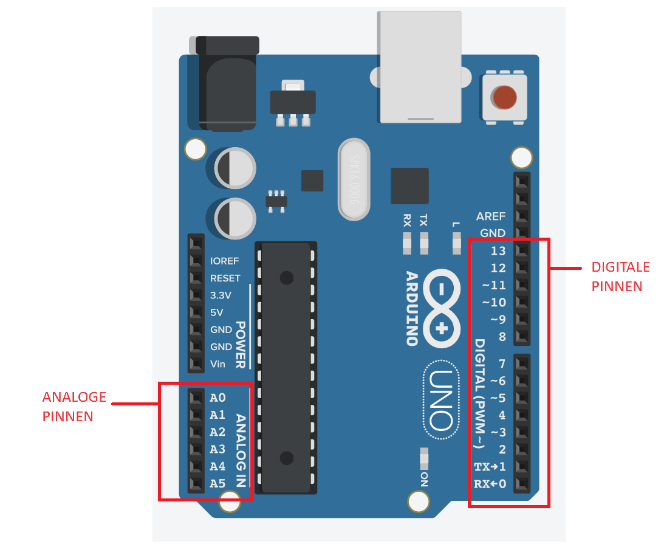

# Digitaal en Analoog 

**Digitaal**: Digitaal gaat over dingen die slechts twee opties hebben: aan of uit, ja of nee, 1 of 0. Het is als een lichtschakelaar die je aan of uit kunt zetten. 
Op een Arduino Uno zijn er 14 digitale pinnen, aangeduid met de labels 0 tot en met 13. Een digitale pin kun je instellen als OUTPUT of als INPUT met de functie `pinMode()`. Deze pinnen geven **0 V (uit)** of **5 V (aan)**.

**Analoog**: Analoog gaat over dingen die meer variatie hebben, zoals een volumeknop of een dimmer voor lampen. Het kan verschillende niveaus hebben in plaats van alleen aan of uit. Het is als het aanpassen van de helderheid van een lamp van heel licht naar heel donker.
Op een Arduino Uno zijn er 6 analoge pinnen, aangeduid met de labels A0 tot en met A5

## Wat is PWM?
De Arduino kan **geen echte analoge spanning** uitsturen (zoals 2,5 V), alleen maar **0 V (uit)** of **5 V (aan)**.  
Met **PWM (Pulse Width Modulation)** lost de Arduino dit op door de pin héél snel aan en uit te schakelen.  

➡️ Als de pin vaker **aan** staat dan **uit**, lijkt het gemiddeld op een hogere spanning.  
➡️ Als de pin vaker **uit** staat dan **aan**, lijkt het op een lagere spanning.

Op een Arduino kunnen alleen de PWM-pinnen deze techniek gebruiken. Deze pinnen hebben het symbool "~" naast het pinnummer. 

Met `analogWrite()` kunnen we deze PWM-functie gebruiken op bepaalde pinnen van de Arduino. We geven de pin en de gewenste helderheid (tussen 0 en 255) door aan `analogWrite()`, en de Arduino past de PWM toe om de LED te regelen.

In Tinkercad gebruik je het onderstaande blok onder Uitgang om een PWM-pin in te stellen met een bepaalde waarde.
  
---

## Voorbeeld met een LED
Met PWM kunnen we effecten zoals fading creëren door de LED geleidelijk helderder of donkerder te maken. Stel je hebt een LED die met PWM wordt aangestuurd:

- **analogWrite(pin, 0)** → LED is helemaal uit  
- **analogWrite(pin, 127)** → LED brandt half zo fel (ongeveer 50%)  
- **analogWrite(pin, 255)** → LED brandt op volle kracht  

De LED knippert eigenlijk héél snel (ongeveer 490 keer per seconde), maar ons oog ziet dat als een bepaalde helderheid.  

---

## Duty Cycle (aan/uit verhouding)
De verhouding tussen de tijd **aan** en **uit** noemen we de **duty cycle**.  

- 0% duty cycle = altijd uit  
- 50% duty cycle = half van de tijd aan → halve helderheid  
- 100% duty cycle = altijd aan  

---

---

## Analogie
Je kunt PWM vergelijken met **snel knipperen met een zaklamp**:  
- Als je de lamp steeds heel kort aanzet en lang uit laat → zwak licht.  
- Als je de lamp lang aan laat en kort uit → fel licht.  
- Als je hem de hele tijd aan laat → maximaal licht.  
