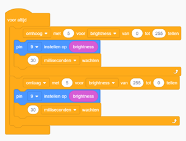

# Opdracht 7: Fade

In deze opdracht leer je hoe je een LED automatisch geleidelijk helderder kunt laten worden en vervolgens geleidelijk kunt dimmen.  
Dit wordt vaak **fade** genoemd en het creëert een mooi visueel effect.  

---

## Begrippen

### For-loop

Een **for-lus** is als een herhalingsmachine voor de computer. Je vertelt hem waar hij moet beginnen, waar hij moet stoppen en hoeveel stappen hij elke keer moet zetten.  
Het is handig voor dingen die je herhaaldelijk moet doen, zoals tellen of acties herhalen.  

**Voorbeeld:**


```cpp
for (int i = 0; i < 10; i++) {
    // Doe iets hier
}
```

Uitleg:  
- `int i = 0` initialiseert een teller met de waarde 0.  
- `i < 10` bepaalt de voorwaarde waaronder de lus blijft doorgaan.  
- `i++` verhoogt de teller met 1 na elke herhaling.  

De code binnen de accolades `{ }` wordt herhaald totdat de voorwaarde `i < 10` niet meer waar is.  
In dit voorbeeld wordt het "iets doen" **10 keer** herhaald (van 0 t/m 9).  

---

## Tinkercad Opdracht

**7.1** Bouw de schakeling na zoals getoond in de afbeelding.  
**7.2** Programmeer de Arduino met de onderstaande code.  




---

## Code

```cpp
int brightness = 0; // Variabele om de helderheid van de LED bij te houden

void setup()
{
  pinMode(9, OUTPUT); // Stel pin 9 in als uitvoerpin voor de LED
}

void loop()
{
  // Verhoog de helderheid van de LED van 0 tot 255 in stappen van 5
  for (brightness = 0; brightness <= 255; brightness += 5) {
    analogWrite(9, brightness); // Stel de helderheid van de LED in
    delay(30); // Wacht 30 milliseconden
  }
  
  // Verminder de helderheid van de LED van 255 tot 0 in stappen van 5
  for (brightness = 255; brightness >= 0; brightness -= 5) {
    analogWrite(9, brightness); // Stel de helderheid van de LED in
    delay(30); // Wacht 30 milliseconden
  }
}
```

---

## Verwerkingsopdracht

**7.3** Pas de code aan om de LED sneller of langzamer te laten faden.  

---

## Fysieke Opdracht

**7.4** Bouw dezelfde schakeling met een fysieke Arduino, een breadboard en een LED.  
Programmeer de Arduino met dezelfde code die je hebt gebruikt in Tinkercad en observeer hoe de LED geleidelijk helderder wordt en dimt.  
