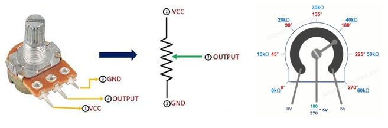
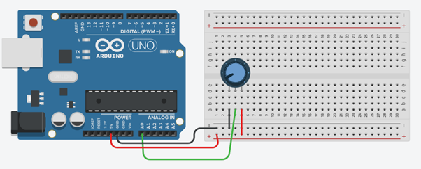

# Opdracht 8: Potentiometer

In deze opdracht leer je hoe je de waarde van een potentiometer kunt uitlezen en weergeven in de **Serial Monitor**.  
Een potentiometer gedraagt zich als een variabele weerstand, die je kunt gebruiken om analoge waarden te meten.  

!!! tip "Uitleg Serial Monitor"
    Nog niet bekend met de Serial Monitor?  Lees eerst de [uitleg](16_serial_monitor.md).

---

## Wat is een potentiometer?

Een **potentiometer** is een soort draaiknop.  
Wanneer je eraan draait, verandert het de hoeveelheid elektrische weerstand in een circuit.  

Toepassingen:  
- Het wordt vaak gebruikt om zaken zoals volume of helderheid aan te passen in elektronische apparaten zoals radio's of lampen.  
- Je kunt het zien als een **dimmer voor elektronica**!  

Een potentiometer sluit je aan op een **analoge pin** van de Arduino.  



---

## Tinkercad Opdracht

**8.1** Bouw de schakeling na zoals getoond in de afbeelding.  
**8.2** Programmeer de Arduino met de onderstaande code.  




---

## Code

```cpp
int sensorValue = 0;

void setup()
{
  pinMode(A0, INPUT);
  Serial.begin(9600);
}

void loop()
{
  // lees de invoer op analoge pin 0:
  sensorValue = analogRead(A0);
  
  // print de waarde in de seriële monitor
  Serial.println(sensorValue);
  
  delay(10); // wacht 10ms
}
```

---

## Verwerkingsopdracht

**8.3** Open de Serial Monitor en lees de waarde van de potentiometer.  
**8.4** Draai aan de potentiometer en zie hoe de waarde in de Serial Monitor verandert.  

---

## Fysieke Opdracht

**8.5** Bouw dezelfde schakeling met een fysieke Arduino, een breadboard en een potentiometer.  
Sluit de potentiometer aan op een analoge pin van de Arduino.  
Programmeer de Arduino met dezelfde code die je hebt gebruikt in Tinkercad en bekijk de waarden van de potentiometer in de Serial Monitor.  
