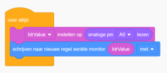

# Opdracht 10: Lichtgevoelige Weerstand (LDR)

In deze opdracht leer je hoe je de waarde van een **lichtgevoelige weerstand (LDR)** kunt uitlezen en weergeven in de **Serial Monitor**.  
Een LDR verandert zijn weerstand afhankelijk van de hoeveelheid licht die erop valt: bij **veel licht** daalt de weerstand, bij **weinig licht** stijgt de weerstand.  
Hierdoor kun je met een LDR lichtintensiteit meten of automatische systemen bouwen (bijv. straatverlichting).

---

## Tinkercad Opdracht

**10.1** Bouw een nieuw circuit in Tinkercad Circuits.  
**10.2** Programmeer de Arduino om de waarde van de LDR uit te lezen en weer te geven in de Serial Monitor.  




---

## Code

```cpp
int ldrValue = 0; // Variabele om de waarde van de LDR op te slaan

void setup()
{
  pinMode(A0, INPUT);  // Stel pin A0 in als invoerpin voor de sensor
  Serial.begin(9600);  // Start de seriële communicatie op 9600 baud
}

void loop()
{
  ldrValue = analogRead(A0);   // Lees de waarde van de sensor
  Serial.println(ldrValue);    // Stuur de waarde naar de Serial Monitor
  delay(10);                   // Korte pauze
}
```

---

## Serial Monitor gebruiken

**10.3** Open de Serial Monitor en lees de waarde van de LDR.  
In Tinkercad kun je op de LDR klikken en aan het **schuifje** slepen om de lichtintensiteit aan te passen. Je ziet de waarde in de monitor veranderen.  

---

## Verwerkingsopdracht

**10.4** Voeg een LED toe aan de schakeling en pas de code aan zodat de LED **gaat branden** wanneer de waarde van de LDR **onder de 500** komt en **uitgaat** wanneer de waarde **boven de 500** komt.  

_Tip:_ gebruik een `if/else` met `analogRead(A0)` en `digitalWrite(ledPin, HIGH/LOW)`.  

---

## Fysieke Opdracht

**10.5** Bouw dezelfde schakeling met een fysieke Arduino, een breadboard, een LDR en een LED.  
Sluit de LDR aan op een **analoge pin** en de LED op een **digitale uitgang** (met weerstand).  
Programmeer de Arduino met dezelfde code die je in Tinkercad hebt gebruikt en bekijk hoe de LED aan- en uitgaat afhankelijk van de LDR-waarde.  
