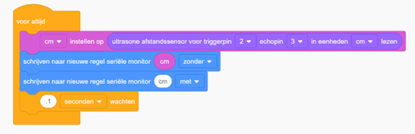

# Opdracht 11: Afstandssensor

In deze opdracht leer je hoe je de afstand kunt meten met behulp van een **ultrasone afstandssensor**.  
Deze sensor bepaalt de afstand tot een object net zoals een vleermuis: hij stuurt ultrasone geluidsgolven uit en meet hoe lang het duurt voordat deze golven terugkomen.  

---

## Tinkercad Opdracht

**11.1** Bouw een nieuw circuit in Tinkercad Circuits.  
**11.2** Programmeer de Arduino om de afstand gemeten door de ultrasone sensor uit te lezen en weer te geven in de Serial Monitor.  




---

## Code

```cpp
const int trigPin = 2; // Trigger pin van de ultrasone sensor
const int echoPin = 3; // Echo pin van de ultrasone sensor
int duration, distance; // Variabelen om de duur en de afstand op te slaan

void setup() {
  pinMode(trigPin, OUTPUT); // Configureer de trigger pin als uitvoer
  pinMode(echoPin, INPUT);  // Configureer de echo pin als invoer
  Serial.begin(9600);       // Start de seriële communicatie op 9600 baud
}

void loop() {
  digitalWrite(trigPin, LOW);       // Zet de trigger pin eerst laag
  delayMicroseconds(2);             // Wacht 2 microseconden
  digitalWrite(trigPin, HIGH);      // Zet de trigger pin hoog om een ultrasoon signaal te verzenden
  delayMicroseconds(10);            // Wacht 10 microseconden
  digitalWrite(trigPin, LOW);       // Zet de trigger pin weer laag
  
  duration = pulseIn(echoPin, HIGH);   // Meet de duur van het echo signaal
  distance = duration * 0.034 / 2;     // Bereken de afstand in centimeters
  
  Serial.print(distance);              // Print de gemeten afstand
  Serial.println(" cm");               // Print de eenheid
  delay(1000);                         // Wacht een seconde voordat de volgende meting wordt uitgevoerd
}
```

---

## Verwerkingsopdracht

**11.3** Voeg een LED toe aan de schakeling en pas de code aan zodat de LED **alleen gaat branden wanneer een object dichter dan 30 cm** bij de sensor komt.  

---

## Fysieke Opdracht

**11.4** Bouw dezelfde schakeling met een fysieke Arduino, een breadboard, een LED en een ultrasone afstandssensor.  
Programmeer de Arduino met dezelfde code die je hebt gebruikt in Tinkercad en observeer wanneer de LED gaat branden bij de gemeten afstanden in de Serial Monitor terwijl je objecten dichterbij of verder weg van de sensor plaatst.  
