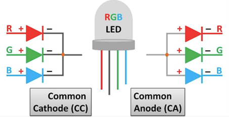
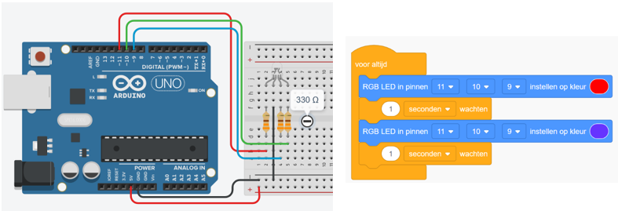
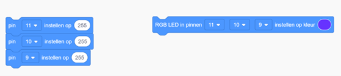

# Opdracht 12: RGB LED

In deze opdracht werk je met een **RGB (rood-groen-blauw) LED**.  
Een RGB‑LED kan meerdere kleuren produceren door de drie afzonderlijke LEDs in één behuizing — **R**ood, **G**roen en **B**lauw — in verschillende verhoudingen te laten branden. Door per kleurkanaal de intensiteit te regelen (met PWM) kun je vrijwel elke kleur maken.




> **Let op:** RGB‑LEDs bestaan in *common cathode* (gemeenschappelijke min) en *common anode* (gemeenschappelijke plus). Pas je schakeling en logica hierop aan. Onderstaande code gaat uit van een common **cathode** RGB‑LED (aansturen met `analogWrite(..., 0–255)`).

---

## Tinkercad Opdracht

**12.1** Bouw een nieuw circuit in Tinkercad Circuits.  
**12.2** Programmeer de Arduino zo dat de RGB‑LED eerst **rood** wordt en daarna **paars**.  



---

## Code

```cpp
const int redPin   = 9;  // Pin voor het rode kanaal van de RGB LED (PWM)
const int greenPin = 10; // Pin voor het groene kanaal van de RGB LED (PWM)
const int bluePin  = 11; // Pin voor het blauwe kanaal van de RGB LED (PWM)

void setup() {
  pinMode(redPin, OUTPUT);
  pinMode(greenPin, OUTPUT);
  pinMode(bluePin, OUTPUT);
}

void loop() {
  // Maak de LED rood
  analogWrite(redPin, 255); // rood maximaal
  analogWrite(greenPin, 0); // groen uit
  analogWrite(bluePin, 0);  // blauw uit
  delay(1000);              // wacht 1 seconde

  // Maak de LED paars (rood + blauw)
  analogWrite(redPin, 255); // rood maximaal
  analogWrite(greenPin, 0); // groen uit
  analogWrite(bluePin, 255); // blauw maximaal
  delay(1000);               // wacht 1 seconde
}
```

---

## Verwerkingsopdracht

**12.3** Verander de code en laat de RGB‑LED eerst **blauw** en daarna **oranje** branden.  
_Tip voor oranje (ongeveer):_ rood ≈ 255, groen ≈ 165, blauw = 0.  

**12.4** Voeg **twee drukknoppen** toe en programmeer de Arduino zodat de kleur van de RGB‑LED verandert met behulp van de knoppen (bijv. volgende/vorige kleur).  

**12.5** Voeg **drie potentiometers** toe en sluit ze aan op analoge pinnen (bijv. A0, A1, A2).  
Lees de waarden uit en stuur daarmee direct de RGB‑kanalen aan met `analogWrite` (0–255).

> **Blokken in Tinkercad:** bij 12.5 kun je **niet** het kant‑en‑klare *RGB LED* blok gebruiken. Gebruik blokken waarmee je **een waarde naar een pin schrijft** (PWM‑uitgang). Gebruik bij opdracht 12.5 de blokken links om de RGB LED aan te sturen, niet het RGB LED blok


---

## Fysieke Opdracht

**12.6** Bouw dezelfde schakeling met een fysieke Arduino, een breadboard en een RGB‑LED (met passende serieweerstanden per kleur).  
Programmeer de Arduino met dezelfde code die je in Tinkercad hebt gebruikt en observeer hoe de kleur van de RGB‑LED verandert wanneer je op de drukknoppen drukt of aan de potentiometers draait.
