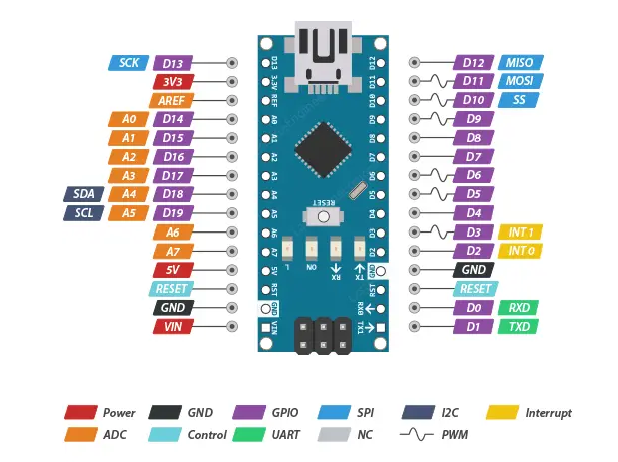
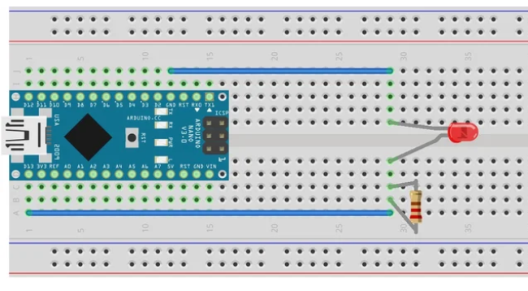

# Arduino Nano

De **Arduino Nano** is een compacte variant van de Arduino-familie. Jullie kennen waarschijnlijk al de **Arduino Uno**, maar soms is een kleinere en lichtere versie handiger. De Nano heeft vrijwel dezelfde mogelijkheden als de Uno, maar in een kleiner formaat.

---

## Belangrijkste verschillen met de Arduino Uno

- **Formaat:**  
  - Nano: klein en smal (ongeveer 4,5 × 1,8 cm).  
  - Uno: groter (ongeveer 7 × 5,3 cm).  

- **USB-aansluiting:**  
  - Nano: gebruikt meestal een **Mini-USB** of **Micro-USB** aansluiting.  
  - Uno: gebruikt een **USB-B** aansluiting (grote printerkabel).  

- **Pinheaders:**  
  - Nano: wordt vaak geleverd met losse pinheaders (je moet soms zelf solderen).  
  - Uno: heeft standaard female headers waar je kabeltjes in kunt steken.  

- **Voeding:**  
  - Nano kan gevoed worden via USB (5 V) of via de VIN-pin (7–12 V).  
  - Uno kan ook via USB of de barrel jack gevoed worden.  

- **Resetknop:**  
  - Nano: een kleine resetknop op de printplaat.  
  - Uno: grotere resetknop, makkelijker bereikbaar.  

---

## Voordelen van de Nano

- **Compact formaat:** past goed op een breadboard of in kleine projecten.  
- **Zelfde functies als de Uno:** bijna alle code en libraries die je voor de Uno gebruikt, werken ook op de Nano.  
- **Goedkoper:** vaak goedkoper dan de Uno.  
- **Lichter:** ideaal voor draagbare projecten (bijv. wearables of drones).  

---

## Aandachtspunten bij gebruik

- **USB-kabel:** gebruik de juiste kabel (Mini-USB of Micro-USB), let op dat sommige kabels alleen opladen en **geen data** kunnen verzenden.  
- **Solderen:** soms moet je de pinheaders zelf vastsolderen voordat je de Nano kunt gebruiken op een breadboard.  
- **Minder stevig:** de Nano heeft geen ingebouwde stekkerverbindingen zoals de Uno; wees voorzichtig bij in- en uitpluggen. 
- **Prototyping:** druk de Nano in een breadboard en maak je verbindingen.

- **Arduino IDE**: zorg dat je de juiste poort en board selecteerd in de Arduino IDE.

---

## Wanneer gebruik je de Nano?

- Als je project **klein** moet zijn en weinig ruimte heeft.  
- Als je de Arduino direct op een breadboard wilt plaatsen.  
- Voor projecten waar de Arduino onderdeel wordt van een groter apparaat (inbouw).  

---

## Samenvatting

De **Arduino Nano** is in de basis hetzelfde als de Uno, maar dan in een **kleiner en lichter jasje**. Het is handig voor compacte projecten en vaak wat goedkoper, maar vraagt iets meer aandacht bij het aansluiten en solderen.

