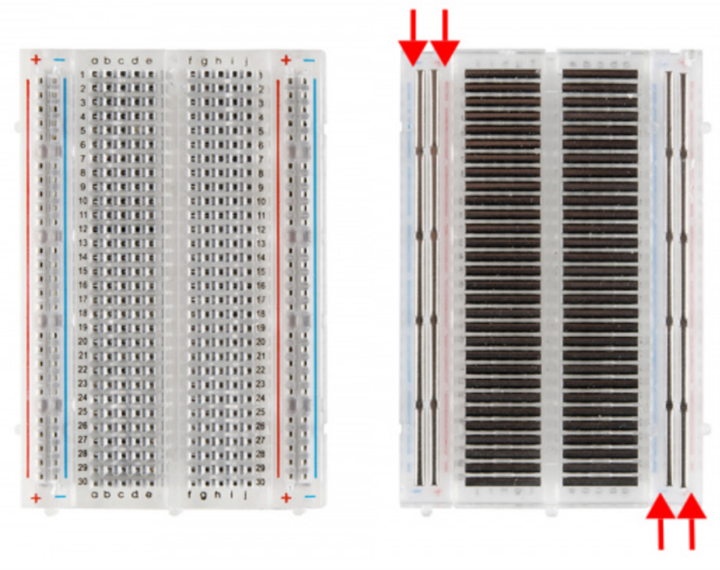

# Breadboard uitgelegd

Breadboards worden gebruikt om snel en gemakkelijk circuits te bouwen en te testen zonder dat solderen nodig is. Dit maakt het ideaal voor prototyping en het experimenteren met verschillende schakelingen.
Een (medium) breadboard bestaat uit rijen en kolommen van gaatjes waarin elektronische componenten kunnen worden gestoken. De rijen zijn meestal gemarkeerd met cijfers (bijvoorbeeld 1-30) en de kolommen zijn gemarkeerd met letters (bijvoorbeeld A-E).
Deze verbindingen zijn belangrijk om te begrijpen:

1.	**Stroomrails**: Aan beide zijden van het breadboard bevinden zich twee rijen van gaatjes, vaak gemarkeerd met rode en blauwe lijnen. De gaatjes in deze rijen zijn verbonden met elkaar en fungeren als stroomrails. Meestal wordt de rode rij gebruikt voor positieve spanning (+5V of +3.3V) en de blauwe rij voor de aarde (GND).
2.	**Kolommen**: De kolommen van gaatjes zijn verticaal gerangschikt en elke kolom bevat meestal vijf gaatjes. De gaatjes binnen elke kolom zijn elektrisch verbonden, maar niet met de gaatjes in andere kolommen. Dit betekent dat als je een component in een bepaalde kolom steekt, het elektrisch verbonden is met alle andere componenten in diezelfde kolom.

*Een breadboard met links hoe de gaatjes met elkaar verbonden zijn.*

## Voorbeeld
Bij het voorbeeld rechts zie je hoe het breadboard gebruikt is om een gesloten stroomkring te maken. In het groen is te zien welke gaatjes met elkaar verbonden zijn.

 
## Tips 
Enkele handige tips en trucs voor het werken met een breadboard zijn:

1. Zorg ervoor dat de componenten stevig in de gaatjes van het breadboard zijn gestoken om slechte verbindingen te voorkomen.  
2. De kleur van de draden maakt niet uit voor hoe het circuit werkt. Wel is het aan te raden om kleuren te gebruiken om de verbindingen gemakkelijker te identificeren: rood voor de positieve kant, zwart voor de negatieve (GND) kant en een andere kleur voor een signaal.  
3. Gebruik korte (zelfgemaakte) draden om verbindingen tussen componenten te maken om rommel te voorkomen.  
4. Voor sommige componenten maakt het uit hoe je ze in een circuit plaatst: Een LED heeft een positieve en negatieve kant, een diode laat de stroom maar in één richting door en een condensator heeft vaak een grijze pijl die naar de negatieve kant wijst.  
5. Zorg dat metalen delen van componenten elkaar niet per ongeluk raken en zo kortsluiting veroorzaken.  
6. Gebruik een multimeter om te controleren of de verbindingen correct zijn gemaakt.  

*Hetzelfde circuit met jumper wires (links) en met zelfgemaakte draadjes (rechts)*