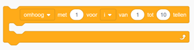

# If-statements en For-loops

## If-statement

Een if-statement is als een beslissingsmoment in een programma. Het zorgt ervoor dat het programma kan beslissen wat te doen op basis van een bepaalde situatie.

Stel je voor dat je een computerprogramma hebt dat controleert of het buiten regent voordat je gaat wandelen. Het programma gebruikt een if-statement om te beslissen of je een paraplu moet meenemen of niet. In eenvoudige bewoordingen zou het er zo uitzien:  

*"Als het buiten regent, neem dan een paraplu mee, anders niet."*

Dus, als het buiten regent (de voorwaarde is waar), dan neem je een paraplu mee. Als het niet regent (de voorwaarde is niet waar), dan ga je gewoon verder.  

Dat is wat een if-statement doet in een computerprogramma: het laat het programma beslissen wat te doen op basis van de huidige situatie.  

In code ziet dat er zo uit:

```cpp
if (voorwaarde) {
    // Voer deze instructies uit als de voorwaarde waar is
}
```

In dit voorbeeld worden de instructies tussen de accolades `{}` alleen uitgevoerd als de voorwaarde waar is. Als de voorwaarde niet waar is, worden deze instructies overgeslagen en gaat het programma verder met de volgende instructies na de if-statement.  

Een if-statement kan ook worden uitgebreid met een else-statement om instructies uit te voeren als de voorwaarde niet waar is. Hier is een voorbeeld:

```cpp
if (voorwaarde) {
    // Voer deze instructies uit als de voorwaarde waar is
} else {
    // Voer deze instructies uit als de voorwaarde niet waar is
}
```

Dit stelt het programma in staat om verschillende acties te ondernemen op basis van de waarde van de voorwaarde.  

In Tinkercad kun je onderstaande blokken onder **Besturen** gebruiken voor een if-statement en een else-statement.  


---

## For-loop

Een for-lus is als een herhalingsmachine voor de computer. Je vertelt hem waar hij moet beginnen, waar hij moet stoppen en hoeveel stappen hij elke keer moet zetten. Het is handig voor dingen die je herhaaldelijk moet doen, zoals tellen of herhalen van acties.  

Bijvoorbeeld:




```cpp
for (int i = 0; i < 10; i++) {
    // Doe iets hier
}
```

- `int i = 0` initialiseert een teller met de waarde 0.  
- `i < 10` bepaalt de voorwaarde waaronder de lus blijft doorgaan.  
- `i++` wordt na elke lusuitvoering gebruikt om de teller met 1 te verhogen.  

De code binnen de accolades `{}` wordt herhaald totdat de voorwaarde `i < 10` niet meer waar is. Dus in dit geval zal het "iets doen" 10 keer herhalen, omdat we beginnen bij 0 en doorgaan totdat we 9 hebben bereikt.  
