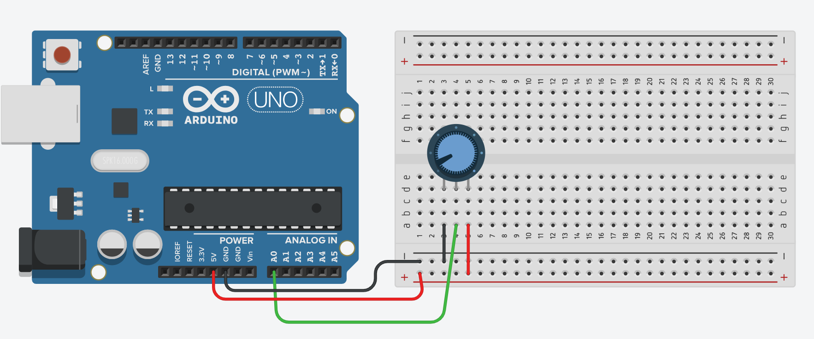

# Potentiometer en Arduino

Een **potentiometer** is een variabele weerstand die je kunt gebruiken om een spanning handmatig aan te passen. Je ziet ze vaak als draaiknoppen (bijvoorbeeld voor volume of lichtsterkte).  

De potentiometer heeft **drie aansluitingen**:
- De middelste pin geeft de variabele spanning (*output*).  
- De twee buitenste pinnen sluit je aan op **VCC (5V)** en **GND**.  

Wanneer je aan de knop draait, verandert de weerstand en daarmee de uitgangsspanning op de middelste pin. Deze spanning kan door de Arduino worden gelezen via een analoge ingang (A0–A5 op de Arduino Uno).  

---

## Voorbeeld: Potentiometer uitlezen met Arduino

In dit voorbeeld sluiten we de middelste pin van de potentiometer aan op **A0** van de Arduino.  

### Schakeling
- **Middelste pin potentiometer → A0**  
- **Linker pin → 5V**  
- **Rechter pin → GND**  



### Code

```cpp
int potPin = A0;     // pin waar de potentiometer op is aangesloten
int potValue = 0;    // variabele om de waarde op te slaan

void setup() {
  Serial.begin(9600); // Start de seriële communicatie
}

void loop() {
  potValue = analogRead(potPin); // lees de waarde (0–1023)
  Serial.println(potValue);      // print de waarde naar de Serial Monitor
  delay(100);                    // korte pauze om de waarden te stabiliseren
}
```

---

## Uitleg
- De **functie `analogRead()`** leest de spanning van de pin en geeft een waarde tussen 0 en 1023 (bij 10-bit ADC).  
- Bij 0V wordt de waarde **0**, bij 5V wordt de waarde **1023**.  
- Tussenliggende spanningen geven proportionele waarden.  

Dit betekent dat je de potentiometer kunt gebruiken als **ingang** om bijvoorbeeld de helderheid van een LED of de snelheid van een motor te regelen.  
