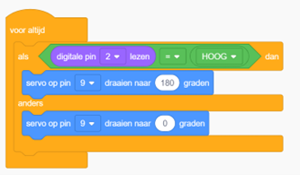

# Opdracht 1: Servo Besturen

In deze opdracht ga je leren hoe je een servo motor kunt besturen met een Arduino. Een servo motor is een speciaal type elektromotor dat wordt gebruikt voor het nauwkeurig regelen van de positie van een object. In tegenstelling tot gewone elektromotoren kan een servo motor worden geprogrammeerd om naar een specifieke hoek te draaien, meestal van 0 tot 180 graden, en die positie vast te houden.  

Dit maakt servo's ideaal voor toepassingen waarbij precisiecontrole van beweging nodig is, zoals bij robotica, modelbouw, afstandsbedieningen en automatiseringssystemen. Je gaat een servo motor aansluiten op de Arduino en programmeren om de positie van de servo te veranderen.


*de SG90 servo motor*

## Bibliotheken

De code bij de opdracht maakt gebruik van de Servo bibliotheek om de servo motor aan te sturen. Een bibliotheek in Arduino is een verzameling van code die vooraf is geschreven om specifieke taken uit te voeren. Deze code kan functies en hulpmiddelen bevatten die het gemakkelijker maken om bepaalde taken uit te voeren zonder dat je alles zelf hoeft te schrijven.    

Je kunt een bibliotheek installeren via de *Bibliotheken Beheerder* in de Arduino IDE en toevoegen aan de code met `#include <…>`. Zet dit bij de start van de code, helemaal bovenaan. Bijvoorbeeld:

```cpp
#include <Servo.h>
```


*Een bibliotheek zoeken en installeren*

---

## Tinkercad Opdracht

**1.1** Bouw de schakeling na zoals getoond in de afbeelding.  
**1.2** Programmeer de Arduino met de code. 




```cpp
#include <Servo.h>

// Definieer de pinnen voor de servo, de drukknop en de variabelen
const int servoPin = 9;
const int buttonPin = 2;
int buttonState = 0;

// Maak een Servo object aan
Servo servo;

void setup() {
  // Initialiseer de servo pin en de drukknop pin
  servo.attach(servoPin);
  pinMode(buttonPin, INPUT);
}

void loop() {
  // Lees de status van de drukknop
  buttonState = digitalRead(buttonPin);

  // Als de drukknop is ingedrukt, draai de servo naar 180 graden
  if (buttonState == HIGH) {
    servo.write(180);
  } else {
    // Anders, draai de servo naar 0 graden
    servo.write(0);
  }

  // Wacht een korte periode voordat de volgende iteratie begint
  delay(10);
}
```

### Verwerkingsopdracht

**1.3** Voeg een tweede knop toe die de servo motor naar 90 graden laat draaien.  

---

## Sweep

**1.4** Programmeer met de schakeling met een servo aangesloten op pin 9 de Arduino met de volgende code. De *sweep* code bij een servo motor beweegt de servo heen en weer tussen twee opgegeven hoeken.

```cpp
#include <Servo.h>

Servo myservo;  // maak een servo object aan om een servo te bedienen
// op de meeste borden kunnen twaalf servo-objecten worden aangemaakt

int pos = 0;    // variabele om de servo positie op te slaan

void setup() {
  myservo.attach(9);  // koppelt de servo op pin 9 aan het servo-object
}

void loop() {
  for (pos = 0; pos <= 180; pos += 1) { // pos gaat van 0 naar 180 graden in stappen van 1 graad
    myservo.write(pos);              // vertel de servo om naar de positie in 'pos' te gaan
    delay(15);                       // wacht 15ms tot de servo de positie bereikt
  }
  for (pos = 180; pos >= 0; pos -= 1) { // gaat van 180 graden naar 0 graden
    myservo.write(pos);              // vertel de servo om naar de positie in 'pos' te gaan
    delay(15);                       // wacht 15ms tot de servo de positie bereikt
  }
}
```

### Verwerkingsopdrachten

**1.5** Verander de code zodat de servo beweegt tussen de 90 en 180 graden.  
**1.6** Verander de code zodat de servo langzamer beweegt.  

---

## Potentiometer

**1.7** Maak een nieuwe schakeling met een servo motor en een potentiometer, waarbij je de positie van de servo motor gaat regelen op basis van de waarde gelezen van de potentiometer.  

Stappen:  
1. Bouw een nieuwe schakeling met een servo motor op digitale pin 9 en een potentiometer aangesloten op de analoge pin A0.  
2. Maak de code: gebruik de analoge ingang van de Arduino om de waarde van de potentiometer uit te lezen. Vertaal deze waarde naar een waarde tussen 0 en 180 en gebruik die waarde om de positie van de servo motor in te stellen.  

---
