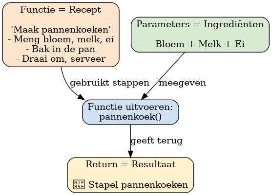
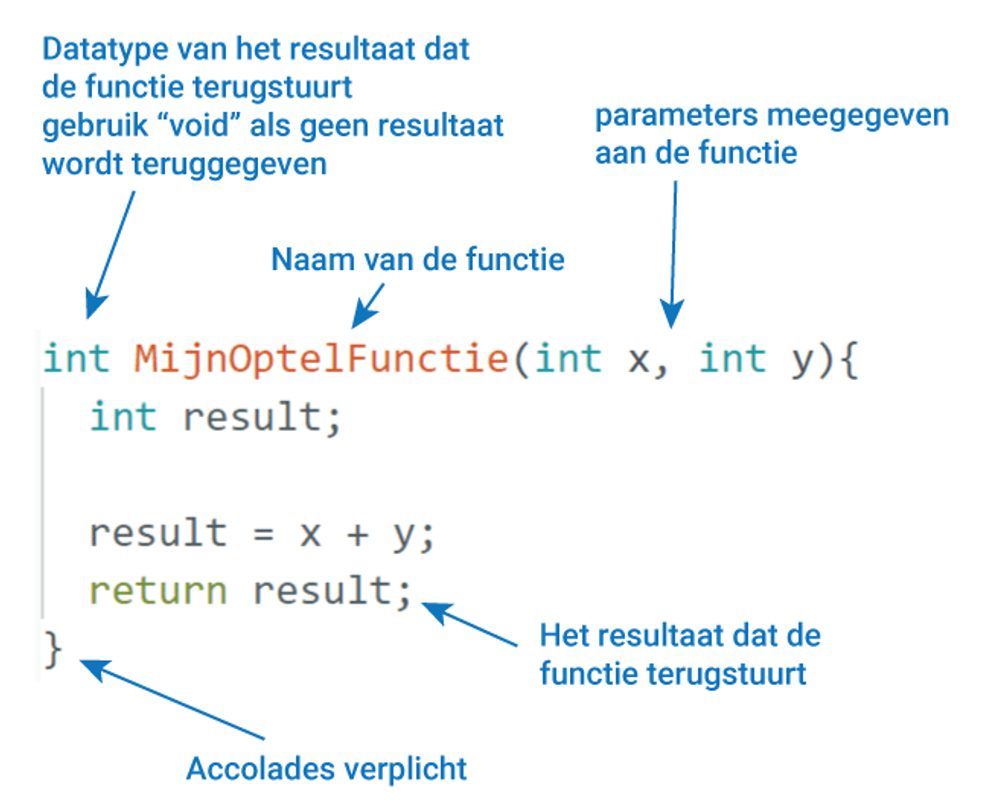

# Wat zijn functies?

Je gebruikt in je dagelijks leven eigenlijk al “functies”, zonder dat je het doorhebt.

## 1. Functies in het dagelijks leven  
Stel je voor dat je een **recept** hebt voor pannenkoeken.  

- Het recept is een **functie**: een vaste set stappen.  
- De **ingrediënten** die je in de functie stopt (bloem, melk, eieren) zijn de **parameters**.  
- Het resultaat is een stapel pannenkoeken (de **return**).  

Het handige is: je hoeft het recept maar één keer op te schrijven. Elke keer dat je pannenkoeken wilt maken, roep je gewoon het **recept (de functie)** aan.  

Als je een andere hoeveelheid pannenkoeken wilt maken, verander je alleen de ingrediënten (de parameter), maar het recept blijft hetzelfde.  



## 2. Functies in programmeren  
In een programma is een **functie** een blokje code dat je een naam geeft en dat je meerdere keren kunt gebruiken.  

Een functie bestaat meestal uit:  
- **Een naam** → zodat je de functie kunt oproepen.  
- **Instructies** → de stappen die uitgevoerd worden.  
- **Eventueel een ingang (parameter)** → iets dat je meegeeft, bijvoorbeeld een snelheid.  
- **Eventueel een resultaat (return)** → iets dat je terugkrijgt, bijvoorbeeld een berekening.  



### Voorbeeld  
```cpp
void halloZeggen() {
  Serial.println("Hallo allemaal!");
}

void loop() {
  halloZeggen();
  halloZeggen();
}
```

Als je dit programma uitvoert, print de Arduino twee keer: **Hallo allemaal!**

## 3. Waarom zijn functies handig?  
- Je hoeft dezelfde code niet steeds opnieuw te typen.  
- Je programma wordt overzichtelijker.  
- Je kunt makkelijk dingen aanpassen: verander je de code in de functie, dan werkt het overal.  

## 4. Functies bij opdracht 3 DC-motoren  
In opdracht 3.5 waarbij je een tweede DC-motor toevoegd zitten in de code functies zoals:  

```cpp
void motorA_vooruit(int pwm) {
  digitalWrite(IN1, HIGH);
  digitalWrite(IN2, LOW);
  analogWrite(ENA, pwm);
}
```

- De **naam** is `motorA_vooruit`.  
- De **parameter** is `pwm`, dit bepaalt de snelheid (tussen 0 en 255).  
- De **instructies** zorgen ervoor dat de motor echt vooruit draait.  

Wil je de motor vooruit laten draaien op halve snelheid? Dan hoef je alleen nog maar te schrijven:  

```cpp
motorA_vooruit(128);
```

En je hoeft dus niet meer de hele set `digitalWrite` en `analogWrite` regels opnieuw te typen.

## 5. Functies met een resultaat (return)

Soms wil je dat een functie iets **uitrekent en teruggeeft**.  
In dit voorbeeld maken we een functie die twee getallen bij elkaar optelt.  

```cpp
// Functie die twee getallen optelt
int MijnOptelFunctie(int x, int y) {
  int result;
  result = x + y;
  return result;   // geef het resultaat terug
}

void setup() {
  Serial.begin(9600);
}

void loop() {
  int uitkomst;

  // Berekening met de functie
  uitkomst = MijnOptelFunctie(5, 7);
  Serial.println(uitkomst);   // print 12

  delay(1000); // even wachten voor de volgende keer
}
```

### Uitleg
- **De functie staat bovenaan** → zo kan hij later in de code overal gebruikt worden.  
- In de `loop()` wordt de functie aangeroepen met `MijnOptelFunctie(5, 7)`.  
- De uitkomst (12) wordt teruggegeven en in `uitkomst` gezet.  
- Daarna print de Arduino elke seconde het resultaat.  