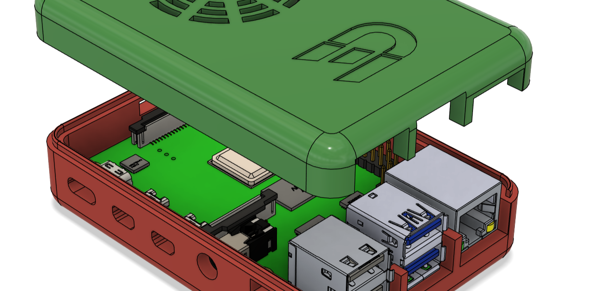
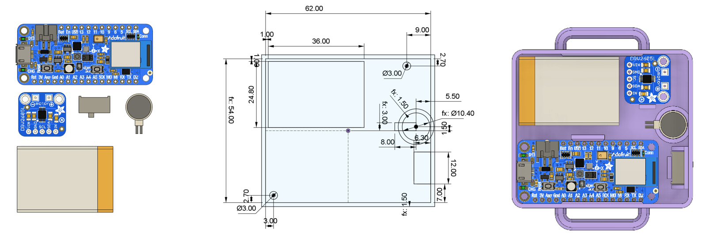
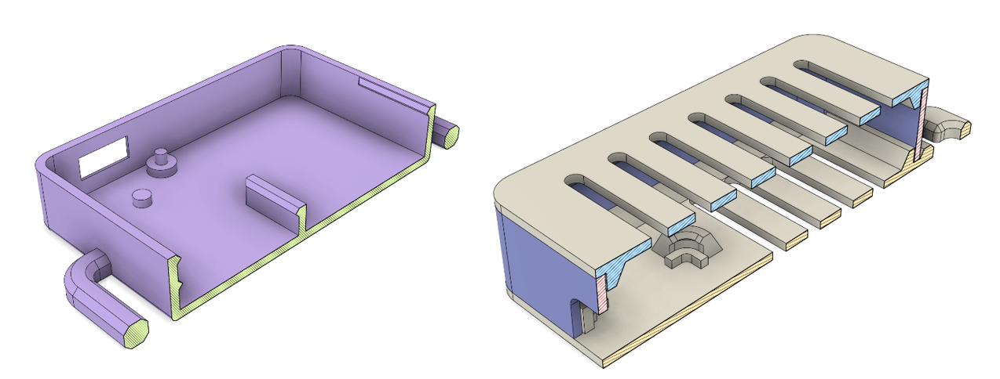
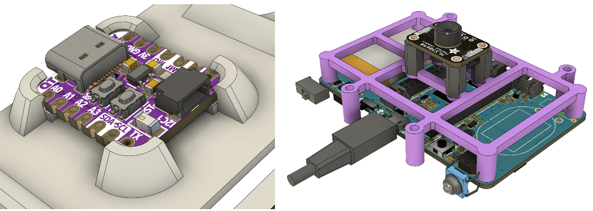
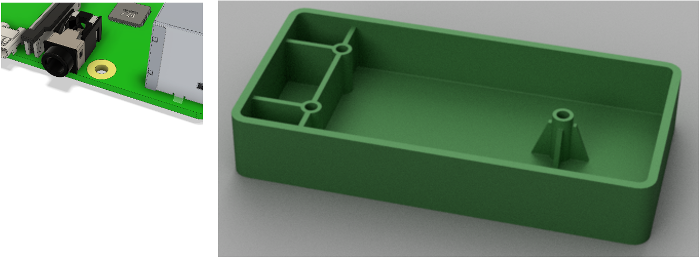
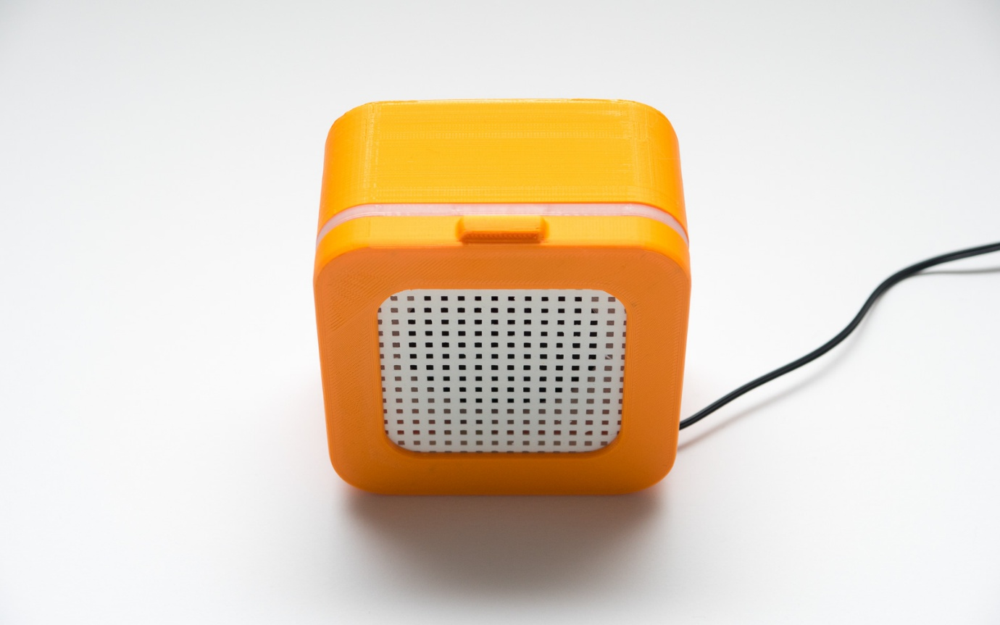

# Behuizing ontwerpen

Behuizingen zijn superbelangrijk bij het ontwikkelen van een product. Ze
beschermen onderdelen, maken het product gebruiksvriendelijk en geven
het een mooie uitstraling. Zeker bij elektronische projecten zorgen
behuizingen ervoor dat bedrading en losse componenten veilig en netjes
opgeborgen zijn.

We behandelen de belangrijkste stappen van het ontwerpproces, van
voorbereiding tot de technische details:

-   **Eisen, wensen en componentenanalyse**: bepalen wat je behuizing
    moet kunnen en welke onderdelen erin komen.

-   **Schetsen en basisvormen**: verkennen van verschillende indelingen
    en ontwerpen van een eerste vorm.

-   **Constructief ontwerpen**: kiezen van wanddiktes, toevoegen van
    verstevigingen, montagepunten en ventilatieopeningen.

-   **Ruimte en toleranties**: zorgen voor voldoende speling rond
    onderdelen, poorten en schroefgaten.

-   **Montagehulp en afwerking**: ontwerpen van lipjes, snap fits en
    afronden van hoeken voor een betere kwaliteit en
    gebruiksvriendelijkheid.

-   **Ontwerpregels en tips**: praktische richtlijnen voor wanddiktes,
    ribbels, bosses en uniforme wanden.

Aan het eind van de handleiding vind je opdrachten en bronnen die je
helpen om je ontwerp nog beter te maken.

**Kortom: deze handleiding geeft je alle handvatten om een sterke,
slimme en professionele behuizing te ontwerpen!**

## Maak een lijst met eisen

Een goede behuizing begint met een duidelijk overzicht van de onderdelen
die erin moeten passen. Daarom analyseer je eerst welke componenten je
gaat gebruiken, wat hun afmetingen zijn, hoe ze bevestigd worden, en
welke aansluitingen toegankelijk moeten blijven.

Voordat je begint met het ontwerpen, is het belangrijk om ook goed in
kaart te brengen **wat de behuizing moet kunnen** en **hoe en waar deze
gebruikt wordt**. Moet de behuizing bijvoorbeeld tegen stoten kunnen,
waterdicht zijn, makkelijk te openen zijn of vooral compact blijven?
Door eisen en wensen vooraf duidelijk op te stellen, werk je veel
gerichter en voorkom je dat je later belangrijke zaken over het hoofd
ziet.

Denk niet alleen aan de onderdelen zelf, maar ook aan het dagelijks
gebruik: wie gebruikt de behuizing, hoe vaak, en onder welke
omstandigheden? Dit heeft invloed op de materiaalkeuze, de vormgeving en
de montage.

Vaak is het handig om een lijst te maken van alle onderdelen en eisen,
en deze later tijdens het ontwerpen af te vinken.

**Tip:** gebruik digitale 3D-modellen van onderdelen (bijvoorbeeld uit
een datasheet of online bibliotheek) om nog preciezer te werken. Handige
websites hiervoor zijn:

-   [GrabCAD Library](https://grabcad.com/library)
    (<https://grabcad.com/library>)

-   [Adafruit CAD Parts](https://github.com/adafruit/Adafruit_CAD_Parts)
    (<https://github.com/adafruit/Adafruit_CAD_Parts>)

Gebruik deze modellen als referentie om de juiste plaatsing te bepalen
en voldoende ruimte te reserveren.

*Figuur 1 3d model van de Raspberry Pi 4b via GrabCAD*

## Schetsen en Basisvormen Ontwerpen

Als je weet welke onderdelen en eisen je hebt, kun je beginnen met het
verkennen van verschillende indelingsopties. Dit betekent dat je nadenkt
over **hoe je de onderdelen in de behuizing plaatst**: naast elkaar,
boven op elkaar, in een rij of in een andere slimme vorm. Soms kies je
voor een compacte indeling om ruimte te besparen, soms juist voor een
ruimere opstelling om onderdelen beter bereikbaar te maken.

Maak eerst een aantal snelle schetsen op papier waarin je verschillende
mogelijkheden verkent. Dit hoeft nog niet netjes of gedetailleerd te
zijn; het gaat erom dat je verschillende ideeën onderzoekt voordat je
verder gaat.

Daarna ontwerp je eenvoudige **basisvormen** voor je behuizing. Denk aan
dozen, cilinders, bollen of combinaties hiervan. De keuze voor een
basisvorm hangt vaak af van de functies, het uiterlijk en de manier
waarop de behuizing gebruikt wordt.

Belangrijke vragen bij deze stap zijn:

-   Welke indeling zorgt voor de meest logische en praktische plaatsing?

-   Welke vorm past het beste bij de functie en het gebruik van de
    behuizing?

-   Hoe zorg je ervoor dat de behuizing stevig blijft en toch makkelijk
    te maken is?

**Tip:** gebruik in Fusion 360 **parameters** om de basisafmetingen vast
te leggen (zoals lengte, breedte, hoogte). Zo kun je later eenvoudig en
snel aanpassingen doen aan je ontwerp zonder alles opnieuw te moeten
tekenen. Veelgebruikte parameters zijn bijvoorbeeld:

-   **Lengte** (Length)

-   **Breedte** (Width)

-   **Hoogte** (Height)

-   **Wanddikte** (WallThickness)

-   **Speling** (Clearance) --- bijvoorbeeld ruimte tussen onderdelen of
    marges rondom een printplaat

Door deze basiswaarden als parameters in te
stellen, blijft je ontwerp flexibel en voorkom je fouten bij
aanpassingen.

*Figuur 2 links: losse componenten, midden: eerste schets om voor de indeling, rechts: componenten in behuizing*

## Constructieve Ontwerpen

Als de basisvorm en indeling bepaald zijn, ga je nadenken over de
**constructieve details** van je behuizing. Dit betekent dat je ervoor
zorgt dat het ontwerp niet alleen functioneel en mooi is, maar ook
stevig, praktisch en goed maakbaar.

## Het bevestigen van behuizingen

Voor het verbinden van onderdelen van een 3D-geprinte behuizing zijn er
verschillende mogelijkheden: **klikverbindingen (snap-fits)**,
**schroefverbindingen** en **flexibele scharnieren (living hinges)**.

**Klikverbindingen** en **drukverbindingen** zijn vooral handig als de
behuizing niet vaak geopend hoeft te worden. Ze zijn makkelijker te
ontwerpen, omdat de verbinding niet extreem slijtvast hoeft te zijn.\
Voor snelle prototypes kun je ook gewoon **lijm** gebruiken. Dat is een
eenvoudige manier om onderdelen permanent aan elkaar te bevestigen.

*Figuur 3 doorsnede van behuizing met snap fit deksel*

**Klikverbindingen** worden veel gebruikt om 3D-geprinte behuizingen
stevig te sluiten zonder extra materialen.

*Figuur 4 behuizing met schroefverbinding met heated inserts*

**Schroefverbindingen** zijn een sterke en snelle oplossing als je wilt
dat de behuizing **meerdere keren makkelijk open en dicht** kan zonder
slijtage.

Je kunt hierbij gebruik maken van:

-   **Zelftappende schroeven**: schroeven die direct in het kunststof
    snijden.

-   **Heated inserts**: metalen inzetstukken die je met een soldeerbout
    in het plastic smelt. Hierdoor kun je gewone machinebouten gebruiken
    en blijft de verbinding veel langer stevig.

## Wanddiktes kiezen

De dikte van de wanden bepaalt voor een groot deel de stevigheid en het
gewicht van de behuizing. Bij 3D-printen wordt vaak een **wanddikte van
1,5 tot 2 mm** gebruikt. Voor grotere behuizingen of zwaardere belasting
kan een dikkere wand nodig zijn. Let op dat wanden niet te dun worden,
anders kunnen ze breken of kromtrekken. Zorg voor een **minimale
wanddikte van 0,8 mm**, oftewel twee keer de diameter van de
printernozzle (0,4 is standaard).

*Figuur 5 doorsnedes van cases, let op wanddiktes*

## Verstevigingen en ondersteuningen

Soms zijn extra verstevigingen nodig om de constructie sterker te maken,
vooral bij grotere oppervlakken of belasting op specifieke punten. Denk
aan:

-   Ribbels aan de binnenkant van de wanden

-   Dikkere hoeken of randverstevigingen

-   Interne draagconstructies om onderdelen te ondersteunen

Zo blijft de behuizing stevig zonder dat je overal dikke wanden nodig
hebt.

*Figuur 6 Ribbels aan de onderzijde van de behuizing voor versteviging*

## Montagepunten en schroefgaten ontwerpen

Bedenk hoe de onderdelen en de behuizing zelf worden vastgezet.
Veelgebruikte oplossingen zijn:

-   Schroefgaten met een verdikking eromheen voor extra stevigheid

-   Klikverbindingen of inkepingen voor onderdelen die zonder schroeven
    vast blijven zitten

-   Houders voor printplaten, batterijen of displays

*Figuur 7 links: klikverbinding om pcb vast te zetten, rechts: houder voor printplaat (paars)*

## Bossen en gaten

Wanneer je schroefbevestigingen gebruikt, is het belangrijk om
**bossen** (verstevigde cilinders rond een schroefgat) toe te voegen.
Bossen vergroten de stijfheid van de behuizing en voorkomen dat het
materiaal vervormt als je een schroef aandraait.

-   Als een schroef direct in het kunststof draait, maak het gat dan
    **0,3 mm kleiner** dan de buitendiameter van de schroef.

-   De **breedte van de bos** moet minimaal gelijk zijn aan de diameter
    van het gat.

-   Combineer bossen waar mogelijk met **ribbels** of
    **hoekverstevigingen** (gussets) om scheuren en breuken te
    voorkomen.

*Figuur 8 links: bevestigingsgat in pcb, rechts: bossen met ribbels (links) en hoekverstevigingen (rechts)*

## Schroeven voor een 3D-geprinte Behuizing

Bij het ontwerpen van een 3D-geprinte behuizing zijn er een paar
veelgebruikte soorten schroeven:

-   **Machineschroeven (machined threads):**\
    Geschikt voor constructies die meerdere keren geopend en gesloten
    moeten worden. De schroef gaat door een iets ruimer gat en draait in
    een moer, een draadbus of een ingesmolten **heat-set insert**. Maak
    het geboorde gat hiervoor **iets groter** dan de buitendiameter van
    de schroefdraad (**free fit**).

-   **Zelftappende schroeven (self-tapping threads):**\
    Ideaal voor onderdelen die maar een paar keer gemonteerd hoeven te
    worden. De schroef snijdt zijn eigen draad direct in het kunststof.
    Het geboorde gat moet hierbij **iets kleiner** zijn dan de
    buitendiameter van de schroef.

-   **Bolkopschroef (bijv. panhead, rounded head):**\
    Een bolkopschroef heeft **geen verzonken gat** nodig. De kop blijft
    zichtbaar bovenop het materiaal liggen. Dit is handig en snel bij
    kunststof behuizingen.

-   **Verzonken schroef (bijv. flat head, countersunk):**\
    Een verzonken schroef heeft een **schuine onderkant** en wordt
    gebruikt in combinatie met een verzonken gat. Daardoor ligt de
    schroef **vlak** in het oppervlak. Dit geeft een netter uiterlijk,
    maar vraagt om extra aandacht bij het ontwerpen van het gat.

**Tips:**

-   Gebruik bij voorkeur **standaardmaten** zoals **M2**, **M2.5** of
    **M3**, passend bij gangbare PCB\'s en sensoren.

-   Voor printplaten (bijvoorbeeld van Adafruit) zijn **M2.5
    bolkopschroeven** meestal geschikt.

*Figuur 9 soorten schroeven*

**Overzicht: Welke schroef kies je?**

| Schroeftype              | Gebruikssituatie                  | Gatmaat ontwerp                                        | Opmerkingen                         |
|--------------------------|-----------------------------------|--------------------------------------------------------|-------------------------------------|
| Machineschroef           | Meerdere keren openen/sluiten     | +0,2 tot 0,4 mm groter dan buitendiameter (free fit)   | Gebruik met moer, draadbus of insert |
| Zelftappende schroef     | Eenmalige of incidentele montage  | -0,2 tot -0,4 mm kleiner dan buitendiameter (press fit)| Schroef snijdt zelf in het plastic  |
| Rounded head (panhead)   | Bij bevestigen van een PCB of vlak oppervlak | Gat: +0,2 tot 0,4 mm groter; Chamfer: 82° hoek, 0,5–1 mm diep | Kop ligt gelijk met het oppervlak |
| Flat head (countersunk)  | Voor mooie vlakke afwerking met verzinking | Gat: +0,2 tot 0,4 mm groter; Chamfer: 82° hoek, 0,5–1,5 mm diep | Voor stevige en nette verbinding |

## McMaster-Carr plug-in in Fusion 360

**McMaster-Carr** is een uitstekende bron om echte schroeven in je
ontwerp te gebruiken:

-   In Fusion 360 kun je via **Insert → McMaster-Carr Component** direct
    schroeven zoeken.

-   Kies het type (bijv. M2.5 platkop), selecteer het materiaal (bijv.
    verzinkt staal) en download het **STEP-bestand**.

-   Zo plaats je realistische schroeven in je model en controleer je
    makkelijk de passing en de ruimte.

**Voordeel:** McMaster-modellen zijn nauwkeurig en geven direct inzicht
in afmetingen zoals de schroefdiameter en aanbevolen gatgrootte.

**Tip:** verlaag bij veel schroeven de modelkwaliteit (LOD) zodat je
computer niet vertraagt door het tekenen van alle schroefdraad.

*Figuur 10 McMaster-Carr bibiliotheek*

## Ruimte rond Componenten en Openingen 

Een veelvoorkomend probleem bij het ontwerpen van behuizingen is dat
onderdelen **vast komen te zitten** of dat openingen niet goed
uitlijnen. Elke productiemethode heeft te maken met **krimp**,
**vervorming** en **machine-toleranties**. Om dit te voorkomen, houd je
bewust **extra speling** **(clearance)** aan.

**Algemene speling tussen losse onderdelen**

-   **Losse (free) fit** -- onderdelen moeten soepel in en uit elkaar
    kunnen:\
    ➔ **0,5 tot 0,7 mm** speling per zijde.\
    ➔ Voor kleine onderdelen (\<50 mm) is **0,3 tot 0,4 mm** vaak
    voldoende.

-   **Strakke (press) fit** -- onderdelen moeten licht klemmen:\
    ➔ **0,1 tot 0,3 mm negatieve speling** (onderdeel iets groter dan
    het gat).

*Figuur 11 speling rond component*

## Speling bij gaten en poorten

-   **Gaten (bijv. schroefgaten)**: Voeg **0,2 tot 0,3 mm** toe aan de
    diameter om te compenseren voor vervorming. Voor betere
    nauwkeurigheid kun je het gat na het printen nog nabewerken
    (bijvoorbeeld boren).

-   **Poorten (bijv. USB, audio-aansluitingen)**: Zorg dat de positie
    van het gat exact klopt en maak het **1 mm groter aan elke zijde**
    dan de aansluiting zelf. Dit voorkomt problemen bij het aansluiten
    van stekkers.

**Tip:** Maak altijd een testmodel als je belangrijke openingen of
aansluitingen hebt. Zo kun je controleren of alles soepel past en stevig
blijft zitten.

**Tip:** Plaats openingen slim zodat het ontwerp stevig blijft. Een
ventilatierooster is bijvoorbeeld sterker dan één groot gat.

*Figuur 12 gaten voor poorten*

## Design-Assisted Assembly: Lippen en Randjes

Wanneer een behuizing uit meerdere delen bestaat (bijvoorbeeld een
boven- en onderkant), helpt een **lip** of **randje** om de delen goed
op elkaar uit te lijnen. Dit maakt de montage makkelijker en vergroot
tegelijkertijd de stevigheid van de behuizing.

Je kunt deze lip tijdens het ontwerpen eenvoudig toevoegen, bijvoorbeeld
als een rand langs de binnenkant van één deel die precies in een
uitsparing van het andere deel past.

**Let op:** houd bij het ontwerpen rekening met de toleranties van je
productiemethode. Laat een **kleine ruimte (0,5 tot 1 mm)** tussen de
lip en de uitsparing zodat de delen soepel op elkaar passen zonder te
klemmen.

*Figuur 13 lip aan deksel voor makkelijke plaatsing*

## Hoeken en Randen Afronden (Fillets)

**Afrondingen (fillets)** helpen om spanningen op de hoeken en randen
van je behuizing te verminderen. Door overal kleine afrondingen toe te
voegen, maak je het ontwerp niet alleen sterker, maar ook mooier en
gebruiksvriendelijker.

Zelfs een kleine afronding van **0,1 mm radius** kan al verschil maken:

-   De spanning in het materiaal wordt beter verdeeld, waardoor het
    minder snel breekt.

-   De wanddikte blijft consistenter, wat beter is voor 3D-printen en
    spuitgieten.

-   De behuizing voelt prettiger aan en ziet er professioneler uit.

**Tip:** vermijd scherpe hoeken in je
ontwerp, zeker bij 3D-printen of spuitgieten. Afgeronde hoeken zorgen
voor een betere printkwaliteit, minder kans op scheuren, en maken het
product veiliger en prettiger in gebruik.

*Figuur 14 afrondingen (fillets) voor consistente wanddikte en uiterlijk*

## Conclusie

Een goed ontwerp voor een behuizing begint bij een goede voorbereiding.
Door eerst de eisen en wensen vast te leggen, de componenten zorgvuldig
te analyseren en slimme keuzes te maken in indeling en basisvormen, leg
je een sterke basis voor je ontwerp.

Met aandacht voor constructieve details zoals wanddikte, montagepunten,
speling, verstevigingen en afrondingen maak je een behuizing die niet
alleen functioneel en stevig is, maar ook makkelijk te produceren en
prettig in gebruik. Kleine aanpassingen, zoals het toevoegen van lipjes
en het goed afwerken van randen, maken uiteindelijk het verschil tussen
een middelmatig en een professioneel resultaat.

Door tijdens het hele proces te werken met duidelijke richtlijnen en
testmodellen voorkom je veelvoorkomende fouten en wordt het ontwerpen
een stuk leuker en succesvoller.

**Kortom: goed nadenken, slim ontwerpen en testen = een betere
behuizing!**

## gebruikte bronnen

**Artikelen en Gidsen**

-   **Enclosure Design for 3D Printing -- Step by Step Guide**\
    <https://www.hubs.com/knowledge-base/enclosure-design-3d-printing-step-step-guide/>

-   **How to Assemble 3D Printed Parts with Threaded Fasteners**\
    <https://www.hubs.com/knowledge-base/how-assemble-3d-printed-parts-threaded-fasteners/>

-   **Best Practices for Adding Ribs and Gussets to 3D Printed Parts for
    Structural Integrity**\
    <https://www.fictiv.com/articles/best-practices-for-adding-ribs-and-gussets-to-3d-printed-parts-for-structural-integrity>

**Video's**

-   **What screws to use in your 3D Print -- David Malawey**\
    <https://www.youtube.com/watch?v=LMyhFwJscI0&ab_channel=DavidMalawey>

-   **Easy Snap Fit Cases! -- Adafruit Industries**\
    <https://www.youtube.com/watch?v=VVmOtM60VWw&ab_channel=AdafruitIndustries>

-   **Parametric Box with Threaded Inserts -- Learn It!**\
    <https://www.youtube.com/watch?v=gs4SNZH0aWA&ab_channel=LearnIt%21>

-   **Fusion 360 Tutorial -- Using McMaster-Carr Hardware -- Adafruit
    Industries**\
    <https://www.youtube.com/watch?v=kxHhZCgyzsg&list=WL&index=13&t=5s&ab_channel=AdafruitIndustries>

-   **Fusion 360 Tutorial -- Sketches and Joints -- Adafruit
    Industries**\
    <https://www.youtube.com/watch?v=ccDCHDljiyU&list=WL&index=7&ab_channel=AdafruitIndustries>

-   **Fusion 360 Tutorial -- PCB Mounting Plates -- Adafruit
    Industries**\
    <https://www.youtube.com/watch?v=QYcDccHG0F4&list=WL&index=24&t=725s&ab_channel=AdafruitIndustries>

-   **Etch Sketch Snap Fit Case -- Adafruit Industries**\
    <https://www.youtube.com/watch?v=YPtBLRRF5BM&list=WL&index=18&ab_channel=AdafruitIndustries>

-   **QT Py Snap Fit Case -- Adafruit Industries**\
    <https://www.youtube.com/watch?v=iXZvdST_OSs&list=WL&index=17&t=19s&ab_channel=AdafruitIndustries>