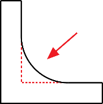
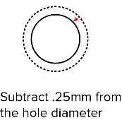
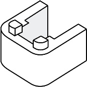
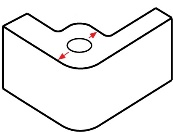

# Overzicht: Ontwerpregels voor Behuizingen

Hoewel toleranties en aanbevelingen voor speling kunnen variëren afhankelijk van de gebruikte printertechnologie en de kalibratie van de printer, geven de onderstaande punten een handige set ontwerpregels om te volgen:

| Afbeelding | Ontwerpregel |
|---|---|
|  | **Wanddikte**: Een aanbevolen wanddikte van **1,5 mm** voor alle wanden van de behuizing. Minimale wanddikte **0,8 mm**. |
|  | **Voeg radiussen/afrondingen toe aan hoeken** Afrondingen (*fillets*) verminderen spanningsconcentraties en maken onderdelen makkelijker te 3D‑printen. Zelfs kleine afrondingen helpen. |
|  | **Ruimte rond componenten** Laat **0,5 mm** ruimte rondom interne componenten i.v.m. vervorming, krimp en printertoleranties. |
|  | **Speling bij gaten**  Voeg **0,25 mm** toe aan de diameter van gaten voor schroeven en bevestigingsmiddelen. Voor nauwkeurigheid na het printen eventueel nabewerken (boren). |
|  | **Zelftappende gaten** Trek **0,25 mm** af van de gatdiameter als de schroef zich in het materiaal moet vastgrijpen (*self‑tapping*). |
|  | **Ruimte rond poorten**  Voor poorten/aansluitingen **2 mm speling** voorzien (1 mm per zijde). Eventueel ingangspoort verlijmen voor een stevige verbinding. |
|  | **Voeg lipjes, uitsparingen en randen toe**  Bij meerdere delen (bodem + deksel) helpen lipjes/uitsparingen/randen bij montage, demontage en uitlijning. |
|  | **Ribbels en verstevigingsstukken**  Ribbels/steunen verminderen spanningen en verhogen de stijfheid. Ontwerp ribbels op **75–80%** van de wanddikte. |
|  | **Versterkingen (bosses) rond gaten**  Extra materiaal rond schroefgaten om uitpuilen/vervorming te voorkomen. Richtlijn: minimaal **1× gatdiameter** aan wanddikte rondom. |
|  | **Gelijke wanddikte** Als je ontwerp uiteindelijk wordt geïnjecteerd in een mal (spuitgieten), is het belangrijk om een **uniforme wanddikte** aan te houden. Ook voor sommige 3D-printtechnieken (vooral SLS en SLA) is dit goede ontwerprichtlijn.
|
