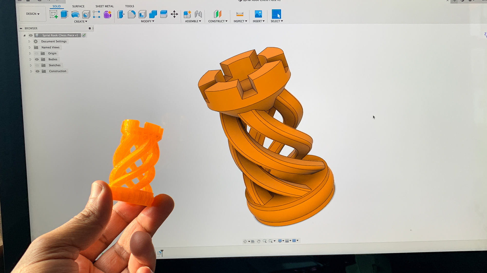
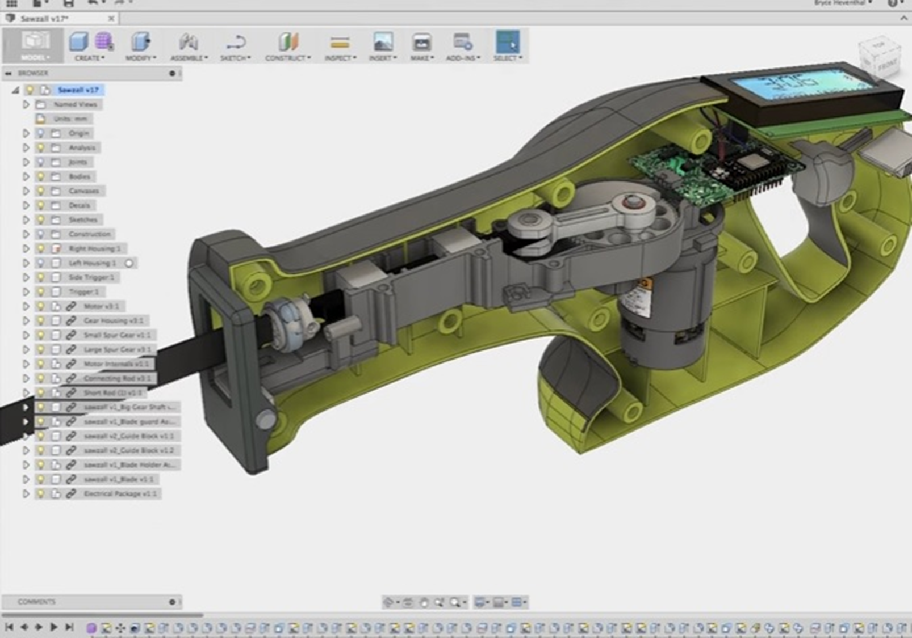
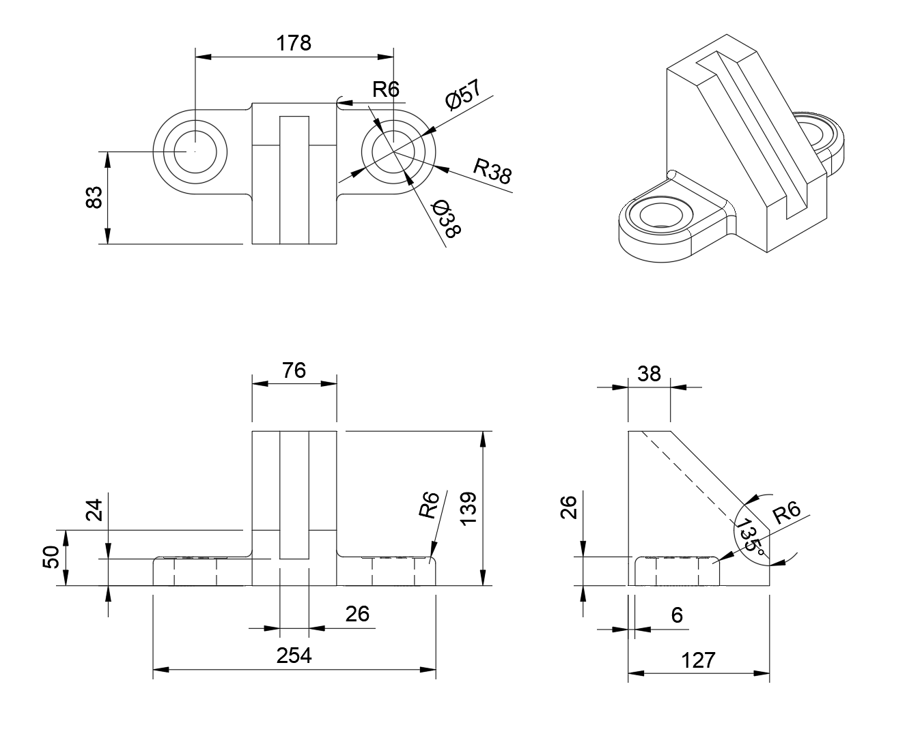
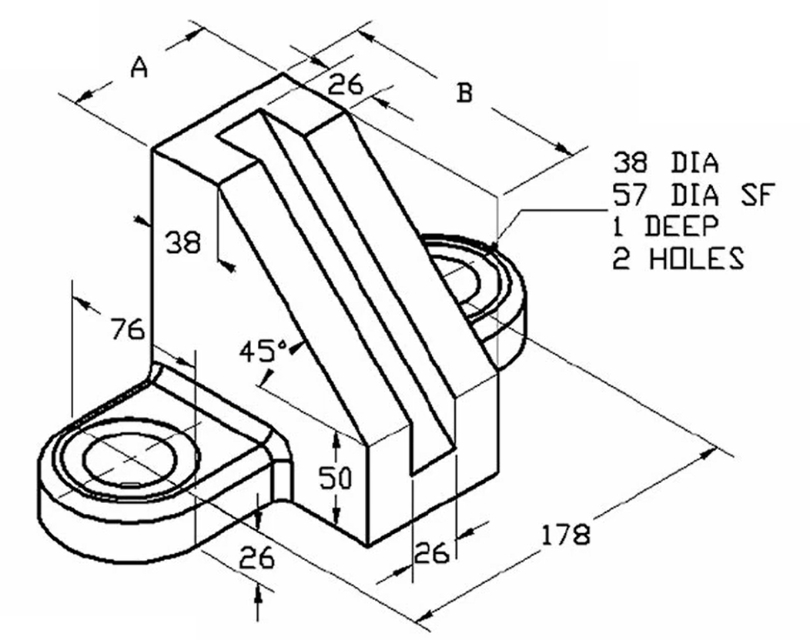

# Introductie tot Autodesk Fusion 360

Welkom bij **Autodesk Fusion 360**!  
In deze module leer je stap voor stap hoe je zelf 3D-modellen maakt, technische tekeningen opstelt en jouw ontwerp kunt voorbereiden voor **3D‑printen**.

Fusion 360 is een krachtig ontwerpprogramma dat wordt gebruikt door ingenieurs, productontwerpers en makers over de hele wereld. Jij gaat nu kennismaken met de basis.

---

## 🎯 Leerdoelen

Aan het einde van deze module kun je:

- ✔️ Een **simpel 3D‑model** maken in Fusion 360  
- ✔️ Een **technische tekening** maken in het programma  
- ✔️ Een model **exporteren om te 3D‑printen**  
- ✔️ De basisprincipes van schetsen, extruderen en modelleren toepassen  

---

## Best Practices voor modelleren

### 1. **Werk altijd vanuit Sketches**
- Begin elk onderdeel met een 2D‑schets.  
- Houd sketches **simpel, overzichtelijk en volledig bepaald in maten en positie**.

### 2. **Gebruik dimensies i.p.v. op het oog tekenen**
- Gebruik `D` voor dimensioneren.  
- Je ontwerp wordt hierdoor nauwkeurig, schaalbaar en aanpasbaar.

### 3. **Werk in Components wanneer nodig**
Vooral bij bewegende onderdelen.

### 4. **Hou je ontwerp netjes**
- Begin bij de oorsprong (EN: origin: Maak je eerste schets op een origin-vlak en centreer deze rond het origin-punt. Bij symmetrische onderdelen plaats je de origin in het midden van de schets.
- Houd je tijdlijn schoon: vermijd lege schetsen en onnodige features
- Geef bodies en sketches een naam  
- Werk met construction geometry  

### 5. **Check je ontwerp regelmatig in 3D**
- Draai met je model  
- Gebruik de sectie‑analyse  

---

# Uitlegfilmpjes

## Video 1 — Overzicht van het programma

In deze video krijg je een eerste rondleiding door Fusion 360. Je ziet waar je de belangrijkste knoppen vindt, hoe de werkruimte is opgebouwd en welke onderdelen van de interface je vaak gaat gebruiken.

<iframe width="560" height="315" src="https://www.youtube.com/embed/mPFRjiuFn_Q" title="Fusion 360 Overview" frameborder="0" allow="accelerometer; autoplay; clipboard-write; encrypted-media; gyroscope; picture-in-picture" allowfullscreen></iframe>

> *Doel: Je weet hoe de interface werkt en wat waar zit.*

---

## Video 2 — Bestanden opslaan en openen

In deze video leer je hoe je een nieuw bestand aanmaakt, opslaat en later weer opent. Ook zie je waar je projecten worden bewaard, zodat je je werk niet kwijtraakt.

<iframe width="560" height="315" src="https://www.youtube.com/embed/1Kh8esBXC4I" title="Fusion 360 Save and Open Files" frameborder="0" allow="accelerometer; autoplay; clipboard-write; encrypted-media; gyroscope; picture-in-picture" allowfullscreen></iframe>

> *Doel: Je kunt je werk altijd terugvinden en veilig opslaan.*

---

## Opdracht 1 — Eenvoudige vorm modelleren

In deze opdracht maak je je eerste simpele 3D-model in Fusion 360. Je oefent met schetsen, extruderen en het netjes afwerken van randen. Probeer de stappen in de video zo precies mogelijk na te doen.

**Video-instructie:**

<iframe width="560" height="315" src="https://www.youtube.com/embed/TZVfCzATR3U" title="Fusion 360 Simple Shape Exercise" frameborder="0" allow="accelerometer; autoplay; clipboard-write; encrypted-media; gyroscope; picture-in-picture" allowfullscreen></iframe>

---

## Opdracht 2 — Complexere vorm

In deze opdracht ga je een wat ingewikkelder model maken. Je combineert meerdere vormen, gebruikt meer schetsvlakken en leert hoe je het ontwerp stap voor stap opbouwt. Let goed op de volgorde waarin in de video wordt gewerkt.

**Video-instructie:**

<iframe width="560" height="315" src="https://www.youtube.com/embed/vSjgPKFzkkE" title="Fusion 360 Complex Shape Exercise" frameborder="0" allow="accelerometer; autoplay; clipboard-write; encrypted-media; gyroscope; picture-in-picture" allowfullscreen></iframe>

---

## Opdracht 3 — Modelleer het onderdeel vanuit de technische tekening

### 🧩 Doel van de opdracht
Je gaat het onderstaande onderdeel volledig namaken in Fusion 360 aan de hand van de technische tekening.  
Je leert:

- Werken vanuit aanzichten  
- Maten correct interpreteren  
- Een logisch modelleringsproces opzetten  
- Features zoals extrude, fillet, holes en schuine vlakken gebruiken  

### 📝 Werkwijze

#### 1️⃣ Analyseer de tekening
Bekijk het bovenaanzicht, vooraanzicht, zijaanzicht en de isometrische view.  
Identificeer:
- De basisvorm  
- Hoogtes en diktes  
- Gaten (Ø) en afrondingen (R)  
- Schuine vlakken en constructievolgorde  

#### 2️⃣ Start met een basis-schets
Begin **op de origin** op een van de hoofdvlakken.  
Teken:
- De onderplaat/zijkant  
- De totale lengte (254 mm)  
- Breedtes en posities van de opgehoogde delen  

Maak de schets volledig *geconstrueerd* (alle lijnen zwart).

#### 3️⃣ Extrudeer de basis
Extrudeer de onderplaat.    

#### 4️⃣ Modelleer de zijvleugels
Gebruik een nieuwe sketch op de onderplaat:
- Teken de zijvleugels 
- Extrudeer tot 26 mm hoogte

#### 5️⃣ Voeg gaten en rondingen toe
- Gaten: Ø38 en Ø57  
- Afrondingen: R6 op randen en overgangen  

Zorg dat de gaten gecentreerd staan zoals op de tekening.

#### 6️⃣ Controleer en vergelijk
Ga elk aanzicht langs:
- Kloppen hoogtes, breedtes en diktes?  
- Zijn afrondingen juist toegepast?  
- Is de schuine kant correct?  

#### 7️⃣ Optioneel
- Voeg materiaal toe  
- Maak een render  
- Maak een technische tekening  

### 📤 Inleveren
- Screenshot van het model

???+ info "Antwoord opdracht 3"
    

      <iframe 
        src="https://www.youtube.com/embed/GXmxlItGDCI?si=0x4RC6UnIfzooMpJ" 
        style="position: absolute; top: 0; left: 0; width: 100%; height: 100%;" 
        frameborder="0" 
        allowfullscreen>
      </iframe>
    

## Opdracht 4 — Werken met componenten en joints

In deze opdracht ga je kennis maken met de kracht van componenten en joints in Autodesk Fusion 360. Je leert hoe je losse delen kunt modelleren, inzetten als aparte onderdelen en vervolgens functioneel kunt samenvoegen zodat beweging of koppeling mogelijk is.

🎯 Leerdoelen

- Je kunt componenten opzetten en benoemen.
- Je kent de verschillende joint-types en weet wanneer je welke gebruikt.
- Je maakt een werkende assemblage waarbij onderdelen correct ten opzichte van elkaar bewegen.

<iframe width="560" height="315" src="https://www.youtube.com/embed/7avr-RXXeUk" title="YouTube video player" frameborder="0" allowfullscreen></iframe>

