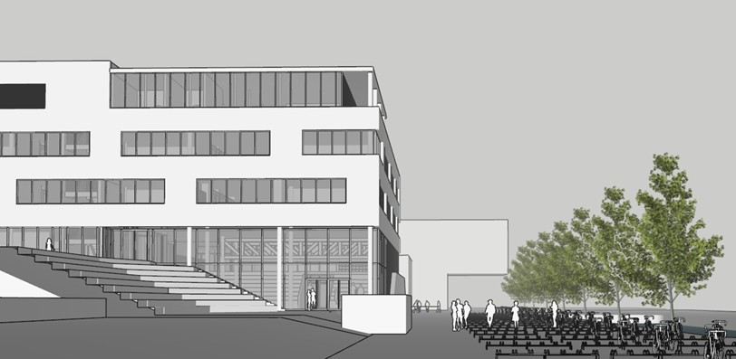

# SketchUp – De basis

## Installeren
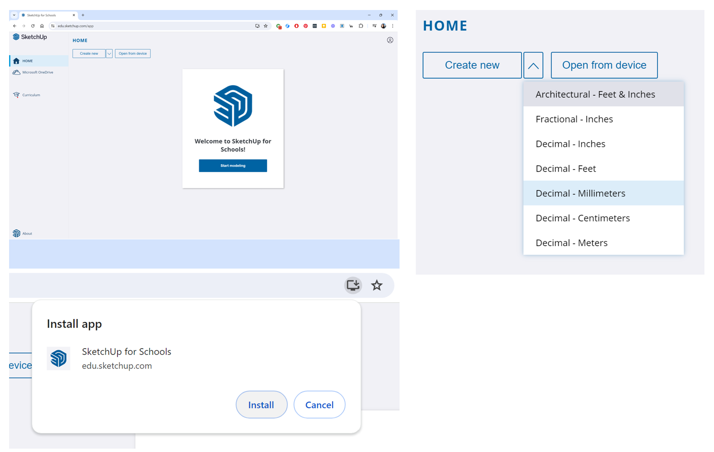

*Ga naar de website en installeer de app zodat je SketchUp makkelijk kunt openen. Gebruik Decimal – Millimeters om een nieuw bestand te maken*

> LEER, ONTWERP EN CREËER JOUW IDEEËN MET SKETCHUP!

SketchUp is een veelzijdig 3D-modelleerprogramma dat perfect is voor architectuur en stedenbouwontwerpen. 
We gaan de webversie van SketchUp gebruiken die perfect is voor leerlingen.
Ga naar de website [SketchUp Web](https://edu.sketchup.com/app), log in met je Windows-schoolaccount en installeer de app via Chrome. Hiermee kun je meteen aan de slag met het ontwerpen en visualiseren van je creatieve ideeën.

<iframe width="640" height="360" 
        src="https://www.youtube.com/embed/SFt1WaDSmNE" 
        title="YouTube video" frameborder="0" 
        allow="accelerometer; autoplay; clipboard-write; encrypted-media; gyroscope; picture-in-picture" 
        allowfullscreen>
</iframe>

---

## De interface
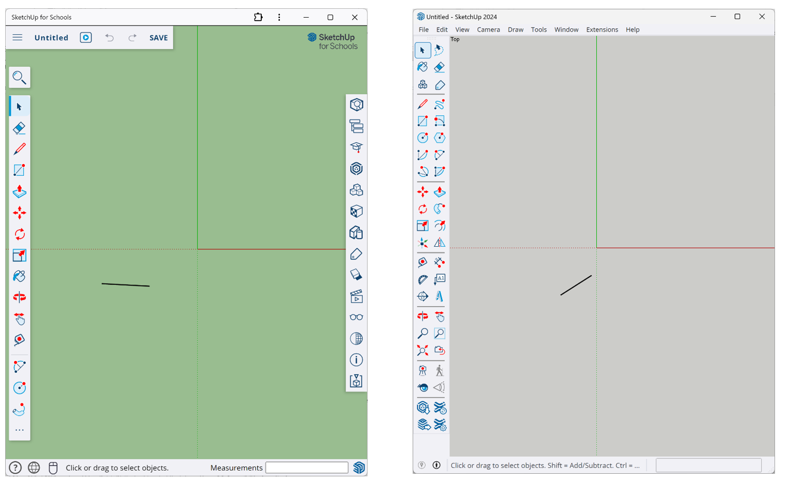
*links SketchUp Free gebruikersinterface en rechtsSketchUp Pro gebruikersinterface*

> DE GEBRUIKERSINTERFACE VAN SKETCHUP FOR WEB IS ANDERS DAN DIE VAN SKETCHUP PRO...

Als je SketchUp wilt proberen — nu met de Web-versie — met het idee dat je later naar de Pro-versie gaat, wees je er dan van bewust dat de interfaces er anders uitzien tussen de twee versies - evenals waar je bepaalde tools, opties en instellingen kunt vinden. 

Je zal dus even moeten wennen als je van de ene naar de andere overstapt.
Maar het goede nieuws is: De belangrijkste tools en functies werken over het algemeen hetzelfde in beide versies.

<iframe width="640" height="360" 
        src="https://www.youtube.com/embed/wQhF7ZgAQBA" 
        title="YouTube video" frameborder="0" 
        allow="accelerometer; autoplay; clipboard-write; encrypted-media; gyroscope; picture-in-picture" 
        allowfullscreen>
</iframe>

---

## 1. Gebruik een muis
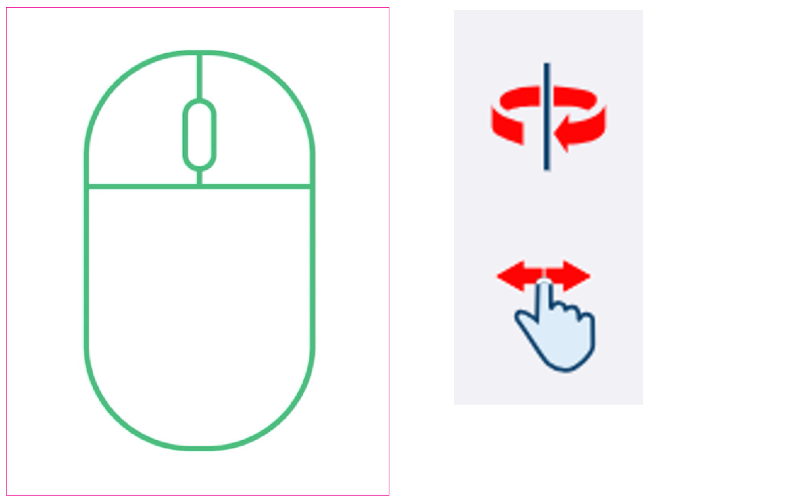

*Je hebt een muis nodig met een linker muisknop, een rechter muisknop en een middelste wieltje dat je kunt klikken EN rollen. Zonder muis moet je de hele tijd naar deze knoppen bewegen of de sneltoetsen gebruiken Orbit (O) en (H) om te pannen*

> OM SKETCHUP TE GEBRUIKEN, IS EEN MUIS MET EEN SCROLLWIEL EN TWEE KNOPPEN HET HANDIGST.

SketchUp is gemaakt om te worden gebruikt met een muis met een scrollwiel en drie knoppen. Dat betekent een muis met een linkerknop, een rechterknop en een scrollwiel in het midden dat je kunt rollen en indrukken.

Door het scrollwiel in te drukken draai je om het model (orbit). Door Shift en het scrollwiel tegelijk in te drukken, beweeg je heen en weer (pannen). En door te scrollen zoom je in en uit.

Als je nieuw bent met SketchUp, zou je in de verleiding kunnen komen om alleen je trackpad te gebruiken. Maar dat zou een vergissing zijn. Je moet dan óf de hele tijd naar de knoppen toe bewegen, wat veel tijd kost óf de sneltoetsen gebruiken (O) voor Orbit en (H) om te pannen. 

Doe jezelf dus een plezier en schaf een muis met een scrollwiel en drie knoppen aan. Het hoeft geen dure te zijn, en je toekomstige zelf zal je zeker dankbaar zijn!

---

## Klikken en loslaten
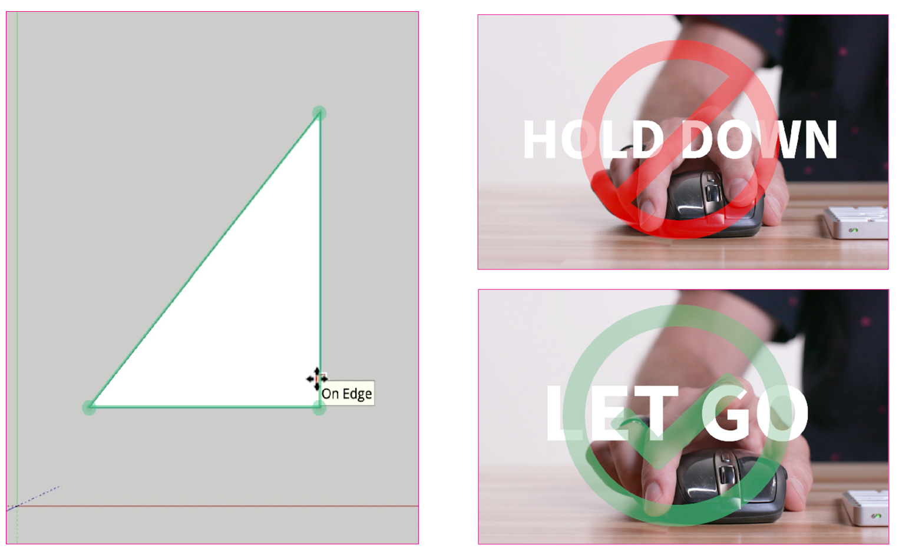

> ONTHOUD "KLIK EN LOSLATEN" BIJ HET GEBRUIK VAN SKETCHUP'S GEREEDSCHAPPEN, EN VERMIJD DE FOUT VAN "KLIKKEN, VASTHOUDEN EN SLEPEN".

Een fout die veel leerlingen maken is dat ze de linkermuisknop indrukken en ingedrukt houden, de muis slepen en vervolgens de knop loslaten. De meeste gereedschappen werken niet goed op deze manier. In plaats daarvan: Klik en laat de linkermuisknop los om een gereedschap te starten, beweeg vervolgens de muis, en klik en laat de linkermuisknop opnieuw los om de bewerking van het gereedschap te voltooien. Met bijna elk gereedschap in SketchUp is dit de juiste manier om de muis te gebruiken.

---

## 2. Start in 2D

*SketchUp staat standaard in een 3D-weergave (boven), maar we raden aan om over te schakelen naar een 2D-weergave (onder). Voor een bovenaanzicht, open het Scenes-paneel en klik vervolgens op het middelste icoon van het dak.*

> BEGINNEN IN 2D HELPT JE OM DE BASISPRINCIPES TE LEREN EN GOEDE GEWOONTEN TE ONTWIKKELEN DIE LATER NUTTIG ZULLEN ZIJN.

Zoals je al hebt gezien, begint SketchUp Free in een 3D-weergave. En de meeste tutorials die je online vindt, beginnen ook in deze 3D-weergave. Maar hier is het probleem:
Beginnen in 3D is alsof je in het diepe springt voordat je hebt leren zwemmen. Je zult eerder gefrustreerd raken en stoppen. En zelfs als je doorgaat, kun je allerlei slechte gewoonten ontwikkelen die je op de lange termijn vertragen.

Wij raden een andere aanpak aan: Schakel over naar een Bovenaanzicht of "2D"-weergave. Om dat te doen, klik je op het Scenes-paneel aan de rechterkant en klik je vervolgens op het middelste dakpictogram als snelkoppeling naar een bovenaanzicht.

---

## 3. Tekenen
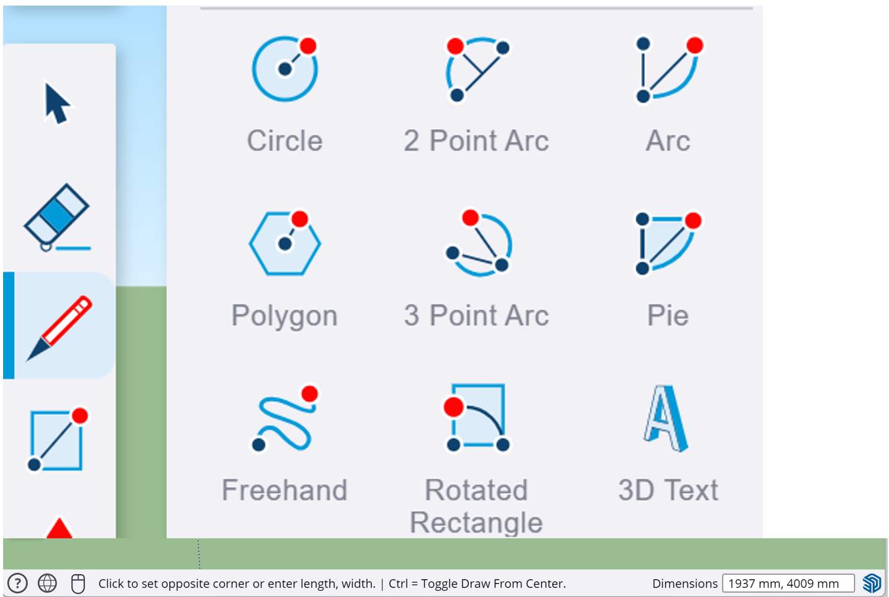
*2d Tekengereedschap: lijn, rechthoek, cirkel, veelhoek, boog. De onderste werkbalk geeft aanwijzingen en maten.*

Wanneer je tekent in SketchUp, bestaat alle geometrie die je maakt uit drie dingen: Eindpunten, Randen en Vlakken. En er zijn 10 basis tekengereedschappen die je zullen helpen bij het creëren van de basisvormen die je nodig hebt in SketchUp. Maar om goed te tekenen, moet je de muis op de juiste manier gebruiken.

> KIJK BIJ IEDER GEREEDSCHAP GOED IN DE ONDERSTE WERKBALK WAT ER VAN JE GEVRAAGD WORDT EN WAT EXTRA MOGELIJKHEDEN ZIJN.

Gebruik de 2D-gereedschappen:  
- **Line:** Tekent rechte lijnen tussen twee punten. Klik om het beginpunt te plaatsen, beweeg de muis om de lijn te tekenen, en klik om het eindpunt te plaatsen.

- **Rectangle:** Tekent rechthoeken. Klik om een hoekpunt van de rechthoek te plaatsen, beweeg de muis om de grootte te bepalen, en klik om de tegenoverliggende hoekpunt te plaatsen.

- **Circle:** Tekent cirkels. Klik om het middelpunt te plaatsen, beweeg de muis om de straal te bepalen, en klik om de cirkel te voltooien.

- **Polygon:** Tekent regelmatige veelhoeken. Klik om het middelpunt te plaatsen, beweeg de muis om de straal te bepalen en het aantal zijden in te stellen, en klik om de veelhoek te voltooien.

- **2 Point-Arc:** Tekent bogen. Klik om het beginpunt van de boog te plaatsen, klik om het eindpunt te plaatsen, en beweeg de muis om de boog te buigen. Klik om de boog te voltooien.

<iframe width="640" height="360" 
        src="https://www.youtube.com/embed/rJog9lpIbRE" 
        title="YouTube video" frameborder="0" 
        allow="accelerometer; autoplay; clipboard-write; encrypted-media; gyroscope; picture-in-picture" 
        allowfullscreen>
</iframe>

---

## 4. Bewerken
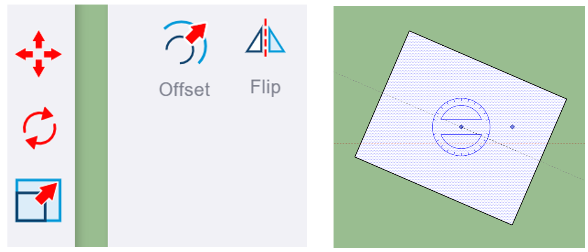

*Met deze gereedschappen kun je (2d) geometrie bewerken en rechts het draaien van een vorm met Rotate*

SketchUp draait allemaal om het maken, bewerken en verwijderen van Eindpunten, Randen en Vlakken. Met de volgende gereedschappen kun je vormen bewerken:

- **Move:** Verplaatst geselecteerde objecten. Klik en laat los op een punt A, verplaats de muis, en klik en laat los op punt B om de verplaatsing te voltooien.
- **Rotate:** Draait geselecteerde objecten rond een vast punt. Klik om het draaipunt te bepalen, sleep om de hoek te kiezen, en klik om te bevestigen.
- **Scale:** Vergroot of verkleint geselecteerde objecten. Klik en sleep aan de grepen om de schaal aan te passen.
- **Offset:** Maakt een parallelle kopie van een lijn of vorm op een specifieke afstand. Klik op een rand, beweeg de muis om de afstand te bepalen, en klik om te bevestigen.
- **Flip:** Spiegelt geselecteerde objecten langs een gekozen as. Kies een as en de objecten worden omgekeerd. 
- **Copy:** Maakt een kopie van de geselecteerde objecten. Gebruik de Move-tool, houd de Ctrl-toets ingedrukt (Option op Mac) en verplaats de kopie naar de gewenste locatie.

<iframe width="640" height="360" 
        src="https://www.youtube.com/embed/DaN2XTE9JEA" 
        title="YouTube video" frameborder="0" 
        allow="accelerometer; autoplay; clipboard-write; encrypted-media; gyroscope; picture-in-picture" 
        allowfullscreen>
</iframe>

---

## 5. Werken met maten
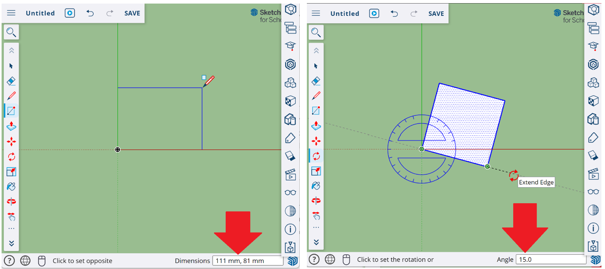

*Maten voer je rechtsonder in in de 'Measurement Box'*

>PRECISIE IS CRUCIAAL VOOR ONTWERPERS. MET SKETCHUP’S GEEF JE JE ONTWERPEN NAUWKEURIGE MAATVOERING

In SketchUp kun je tijdens het tekenen van 2D-vormen nauwkeurige maten instellen door gebruik te maken van de **'Measurements Box'** rechtsonder in het scherm. Voordat je een lijn of vorm tekent, typ je de gewenste lengte, breedte of andere dimensie in deze box. 

Bijvoorbeeld, als je een lijn van precies 100 millimeter wilt tekenen, typ je '100mm' en druk je op Enter voordat je het eindpunt van de lijn plaatst.

Om afstanden te meten tussen punten in je tekening, gebruik je de **'Tape Measure'** tool. Klik op een punt om te beginnen met meten, beweeg de muis naar het tweede punt en klik opnieuw. De afstand tussen de twee punten wordt weergegeven, wat handig is voor nauwkeurig positioneren en dimensioneren van objecten in je ontwerp.

---

## 6. Van 2D naar 3D
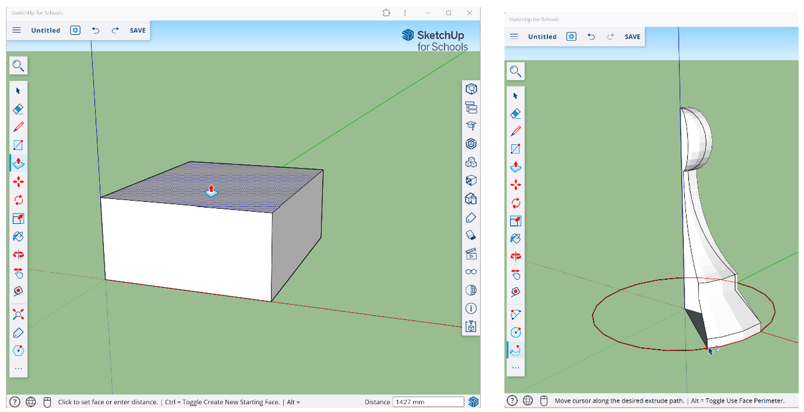

*Gebruik van Push/Pull om een vorm omhoog te trekken en rechts Follow-Me om een vorm een lijn te laten volgen*

Nu je gewend bent geraakt met het tekenen in 2D kunnen we de stap naar 3D maken.

Om 2D vormen in SketchUp om te zetten in 3D, kun je het **Push/Pull**-gereedschap gebruiken door een 2D vorm te tekenen, Push/Pull te selecteren, en de vorm omhoog of omlaag te extruderen. 

Voor complexere vormen gebruik je het **Follow Me**-gereedschap door een 2D vorm en een pad te tekenen, het pad te selecteren, Follow Me te kiezen en vervolgens op de vorm te klikken om deze langs het pad te extruderen.

Je kunt op de 3D-vormen tekenen met de 2D-gereedschappen en de 3D-vormen bewerken met de bewerkingsgereedschappen om zo je ontwerp te creëren

<iframe width="640" height="360" 
        src="https://www.youtube.com/embed/NFVmxGB7KOs" 
        title="YouTube video" frameborder="0" 
        allow="accelerometer; autoplay; clipboard-write; encrypted-media; gyroscope; picture-in-picture" 
        allowfullscreen>
</iframe>

---

## 7. Plakkerigheid
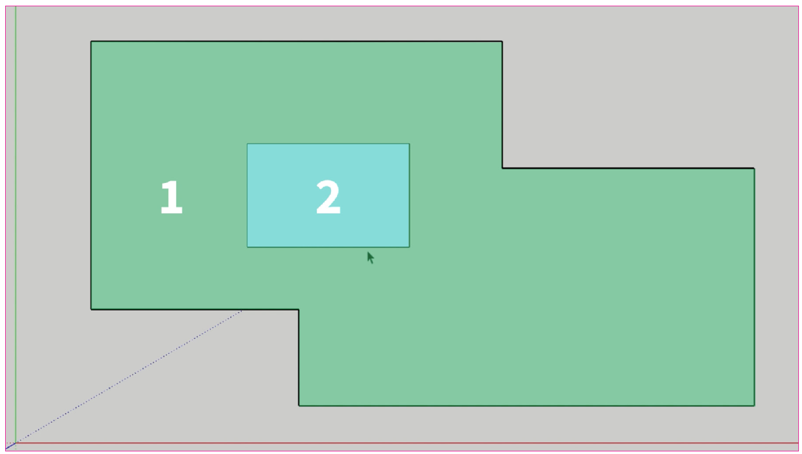

*Overlappende randen en vlakken blijven aan elkaar plakken, waardoor je randen en vlakken kunt wissen om nieuwe vormen te creëren*

Wanneer je vormen maakt in SketchUp, blijven de randen en eindpunten plakken aan andere randen en eindpunten. Dit kan super handig zijn voor het snel modelleren van dingen, zoals overlappende vormen om nieuwe te creëren.
 
Zo behulpzaam als plakkerigheid kan zijn voor het maken van nieuwe vormen — kan het op de lange termijn ook de meest pijnlijke problemen veroorzaken die je ooit zult tegenkomen in SketchUp, waar objecten die je probeert te bewerken vast komen te zitten aan andere dingen in je model!

Dat is waar de volgende tip van pas komt...

---

## 8. Groeperen
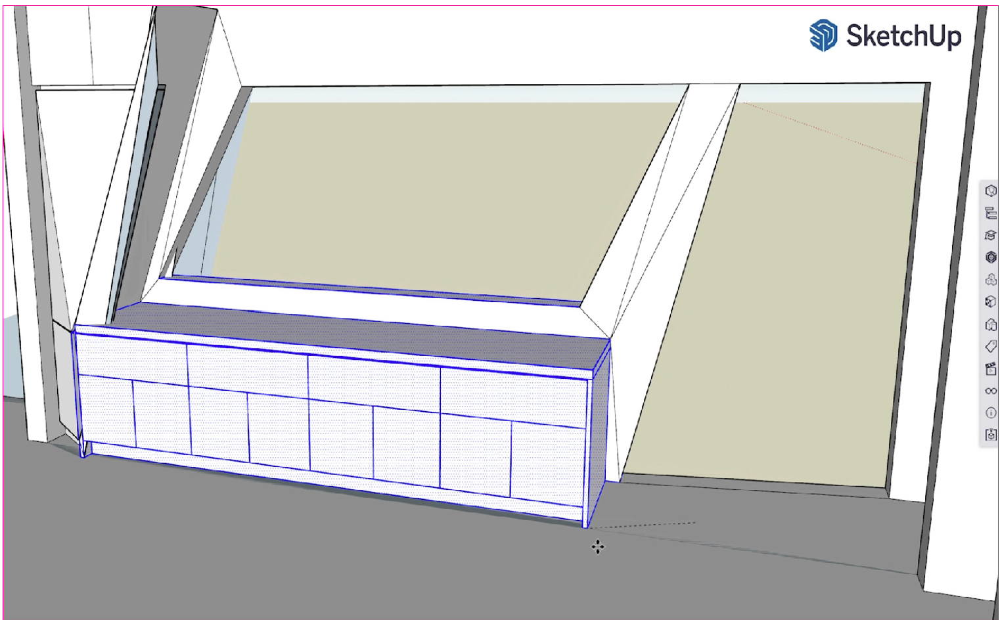

*Ongegroepeerde geometrie blijft plakken aan andere ongegroepeerde geometrie, wat een rommel veroorzaakt wanneer je later dingen verplaatst of bewerkt.*

> MAAK ALTIJD EEN GROEP VAN IETS IN SKETCHUP VOORDAT JE HET VOLGENDE TEKENT.

Om te voorkomen dat dingen vast komen te zitten die niet vast zouden moeten zitten, kun je ze beschermen tegen andere vormen door ze eerst om te zetten in een **Groep**. Geometrie die gegroepeerd is, plakt niet aan iets anders vast.

Om een Groep te maken, selecteer de gewenste randen en vlakken, klik dan met de rechtermuisknop op de selectie en kies de optie om een Groep te maken.

Dit is verreweg het grootste probleem waar zelflerende gebruikers tegenaan lopen: Ze modelleren zonder Groepen te maken en eindigen met een onbewerkbare warboel.

Dus groepeer vroeg en groepeer vaak. Je toekomstige zelf zal je dankbaar zijn!

<iframe width="640" height="360" 
        src="https://www.youtube.com/embed/OIDNGY84pTs" 
        title="YouTube video" frameborder="0" 
        allow="accelerometer; autoplay; clipboard-write; encrypted-media; gyroscope; picture-in-picture" 
        allowfullscreen>
</iframe>

---

## 9. Componenten
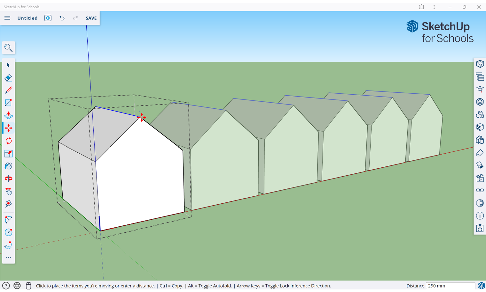

*Telkens wanneer je iets meerdere keren gaat gebruiken, maak er een Component van en gebruik vervolgens het Move-gereedschap om kopieën te maken*

Telkens wanneer je van plan bent om iets meer dan eens te gebruiken in je huidige model, of je kunt je voorstellen hoe je het in de toekomst opnieuw zou kunnen gebruiken, is het beter om er een **Component** van te maken in plaats van een Groep.

Componenten zijn net als Groepen, met als belangrijkste verschil dat wanneer je meer dan één component in een model hebt, je er één kunt bewerken om ze allemaal te bewerken.
 
> COMPONENTEN ZIJN GROEPEN MET ÉÉN BELANGRIJK VERSCHIL: BIJ MEERDERE COMPONENTEN KUN JE ER ÉÉN BEWERKEN OM ZE ALLEMAAL TE VERANDEREN

---

## 10. Materialen

Om Kleuren of Materialen toe te passen op een vlak in SketchUp, zorg er eerst voor dat je in de modus Groep of Component Bewerken bent, zodat je dat vlak kunt bewerken. Kies dan het **Emmer**-gereedschap en kies uit een van de vooraf geladen kleuren en materialen.

Als je andere materialen wilt importeren, kun je dat doen door naar het bovenste menu te gaan en te klikken op "Invoegen". Kies vervolgens het bestand van het materiaal dat je naar SketchUp wilt brengen en selecteer om in te voegen als een Materiaal. Je ziet het beeld bijgevoegd aan het emmer-gereedschap; klik eenmaal en beweeg de muis om de schaal in te stellen - klik dan nogmaals en het materiaal zal tegels of herhalen over het vlak.

> ZORG ERVOOR DAT JE IN DE MODUS GROEP OF COMPONENT BEWERKEN BENT, ZODAT JE KLEUREN EN MATERIALEN RECHTSTREEKS OP HET VLAK KUNT AANBRENGEN.

<iframe width="640" height="360" 
        src="https://www.youtube.com/embed/EPM7DXbAtas" 
        title="YouTube video" frameborder="0" 
        allow="accelerometer; autoplay; clipboard-write; encrypted-media; gyroscope; picture-in-picture" 
        allowfullscreen>
</iframe>

---

## 11. 3D Warehouse
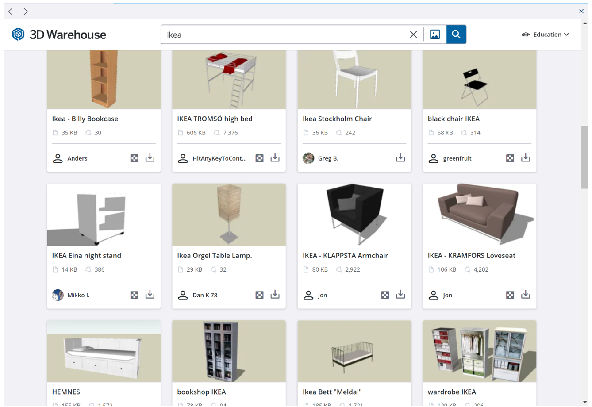

Bij het toevoegen van objecten aan je modellen, hoef je niet alles zelf te modelleren! SketchUp biedt toegang tot de **3D Warehouse**, een uitgebreide bibliotheek van componenten gemaakt door andere gebruikers, die je gratis kunt gebruiken in je projecten.

De 3D Warehouse maakt het eenvoudig om allerlei verschillende objecten te vinden – van meubels, planten, apparaten, noem maar op! Veel van deze modellen zijn zelfs gemaakt volgens de exacte productspecificaties van de fabrikanten zelf.
Het gebruik van deze 3D-componenten kan je veel tijd besparen en je modellen er geweldig uit laten zien!

> COMPONENTEN UIT DE 3D WAREHOUSE KUNNEN NET ZO WORDEN BEWERKT ALS DE COMPONENTEN DIE JE ZELF MAAKT.

<iframe width="640" height="360" 
        src="https://www.youtube.com/embed/GG4AaAkbXa4" 
        title="YouTube video" frameborder="0" 
        allow="accelerometer; autoplay; clipboard-write; encrypted-media; gyroscope; picture-in-picture" 
        allowfullscreen>
</iframe>

---

## Opdracht: Wolkenkrabber

Het werken met een 3D-programma zoals SketchUp vraagt oefening om er beter in te worden.

Oefen de voorgaande vaardigheden door een wolkenkrabber voor ver in de toekomst te ontwerpen. Je hoeft geen rekening te houden met zwaartekracht, draagconstructie: Laat je creativiteit de vrije loop

Laat in je model zien dat je:

- verschillende vormen kunt maken in 3d;
- deze vormen kunt kopiëren, schalen en bewerken
- gebruik maakt van groepen
- gebruik maakt van componenten
- gebruik kan maken van de 3d Warehouse

